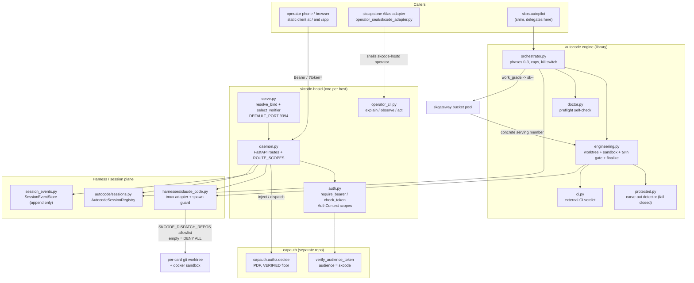

# skharness - Standard Operating Procedures

`skharness` is SKWorld's **execution plane**. It is two things in one distribution: the
capauth-gated `skcode-hostd` daemon (a tailnet-only FastAPI remote-control surface over
agent sessions) and the **autocode engine** library (the assess/plan/build/grade/finalize
loop that `skos autopilot` delegates to). Callers are the operator's phone/browser client,
Atlas's skcode adapter in `skcapstone`, and `skos.autopilot`.

> This SOP is the operational source of truth. Design documents live under
> [`docs/superpowers/specs/`](./docs/superpowers/specs/) and
> [`docs/specs/`](./docs/specs/); they are historical and some predate the current write
> surface. Where a spec and this SOP disagree, trust the code and this file.

---

## 1. Overview

**Purpose.** Let a human drive a swarm of coding agents from a phone over the tailnet,
with no third-party relay, and let the autocode engine drive the same agents unattended
behind a merge gate.

**What it owns.**

- `skcode-hostd`: the per-host daemon. One host, one `Harness` (the claude-code tmux
  adapter), one bound tailnet address on port **9394**.
- The **session plane**: session descriptors, the append-only `SessionEvent` store, and
  the merged view of interactive sessions plus autocode orchestrator runs.
- The **authorization enforcement point (PEP)** for that surface: bearer check, scope
  split, and a `capauth.authz.decide` call for the two RCE-class capabilities.
- The **autocode engine** (`src/skharness/autocode/`): work-item routing, the sandboxed
  build, the twin gate (grade plus external CI), the constitutional carve-out detector,
  and finalize/automerge.
- The sandbox build contexts under `docker/sandbox/` (claude, claude-flutter, opencode,
  pi, proxy).

**What it explicitly does NOT do.**

- It is **not** a policy decision point. It never decides authorization itself: capauth
  is the PDP, this daemon is the PEP. No authorizer configured means dispatch is denied
  (`501`), never allowed.
- It **generates, stores, and wraps no key material.** Crypto here is **verify only**:
  `serve.build_capauth_verifier` base64url-decodes the wire token, `import_token`s it, and
  calls capauth's `verify_audience_token` (`src/skharness/serve.py:96-107`). Identity,
  issuance, and revocation belong to [capauth](https://github.com/smilinTux/capauth).
- It is **not** the coordination board. Cards, epics, and ITIL records live in
  `skcoord`/`skcapstone`; the engine reads and writes them through the
  `skcapstone.coordination` shim.
- It is **not** a public service. There is no `:443` route, no Cloudflare Tunnel, and no
  Funnel exposure. See section 5, Front-end / Exposure.
- It does **not** provide a `/health` or `/healthz` route. Liveness is reported through
  `skcode-hostd operator observe` and `GET /api/v1/hosts/self`.

---

## 2. Architecture



### Start here

| File | Why it is the entry point |
|---|---|
| `src/skharness/serve.py` | The `skcode-hostd` entry point. `resolve_bind()` refuses a wildcard bind, `select_verifier()` picks real capauth or the fail-closed deny-all, `_serve()` wires every provider into the app. Read this first. |
| `src/skharness/daemon.py` | Every HTTP/WS route, plus `PUBLIC_ROUTES` and `ROUTE_SCOPES`: the authoritative statement of which route needs which scope. |
| `src/skharness/harnesses/claude_code.py` | The one harness the daemon owns. `parse_repo_allowlist()` and the `spawn()` guard are where dispatch is actually permitted or refused. |
| `src/skharness/autocode/orchestrator.py` | The engine's phase loop, caps, and kill switch. `skos.autopilot` delegates here by object identity. |
| `src/skharness/autocode/engineering.py` | The merge choke point: worktree, sandbox, grade, twin gate, `finalize()`. Nothing merges without passing through it. |
| `src/skharness/autocode/buckets.py` | Mechanical, fail-closed mapping from a complete card `work_grade` to the SKGateway bucket id carried as the per-call model override. |

Continual improvement and the production Pi execution image are governed by
[`docs/architecture/continual-harness.md`](./docs/architecture/continual-harness.md).
That design keeps execution, verification, refinement, and optional training as
separately versioned planes and records the canonical coordination epic (`4aca533c`).

---

## 3. Build

Pure Python, `setuptools` plus `setuptools_scm`. No compilation step.

```bash
git clone https://github.com/smilinTux/skharness && cd skharness
python -m pip install -e ".[dev]"
```

Fleet service installs use the owned operational venv. ML, TTS, security tooling,
and desktop-audio packages must not be installed into it:

```bash
./systemd/install-skops-runtime.sh
~/.venvs/skops/bin/python -m pip check
```

Distribution build (what CI's `build` job runs):

```bash
python -m pip install build twine
python -m build
python -m twine check dist/*
```

**Always clone with tags.** The version is derived by `setuptools-scm` from the newest
`v<major>.<minor>.<patch>` tag (`[tool.setuptools_scm]` pins `tag_regex` and
`git_describe_command` to that shape, so the repo's non-SemVer tags such as
`swarm-20260717` cannot hijack the version). A shallow or tagless checkout produces a
placeholder like `0.1.dev1`. Every CI checkout therefore sets `fetch-depth: 0` and
`fetch-tags: true`.

**Sandbox images** are built separately and are not part of the Python build:

```bash
./docker/sandbox/build.sh
```

---

## 4. Test

The green bar is `.github/workflows/ci.yml` on push and pull request against `main`.
`publish.yml` deliberately does not gate on tests, so **CI is the only place the suite
runs**. Four jobs, all of which must pass:

| Job | What it proves |
|---|---|
| `lint` | `ruff check src/ tests/` on Python 3.12. |
| `test` | The anti-skip gate, then the full suite on 3.12 with the **real siblings** installed. |
| `compat-3-10` | The package and the autocode core import cleanly on the declared `requires-python` floor, plus the sibling-free unit tests. |
| `build` | `python -m build` and `twine check dist/*`. |

### The anti-skip gate (the part worth knowing)

`tests/test_autopilot_failure_memory_roundtrip.py` spans two repos: `skcoord` owns the
card writer, `skharness` owns the reader. Those tests **self-skip** when the sibling is
missing, which is correct on a dev box and wrong in CI, where running them is the entire
point. The job therefore captures the pytest output and **fails if it contains the word
`skipped`**:

```bash
out="$(python -m pytest tests/test_autopilot_failure_memory_roundtrip.py -q -rs 2>&1)"
grep -qi "skipped" <<<"$out" && exit 1
```

A skipped gate reports green while checking nothing. This one cannot.

### Sibling install order is load-bearing

CI installs `skos`, `capauth`, `skcapstone`, then **`skcoord` LAST with `--upgrade`**.
`skcapstone` depends on `skcoord>=0.1.0`, which pulls the released PyPI wheel; that wheel
lags `main` and can be missing the very API under test. Installing `skcoord` from git
`main` last is what makes the job test merged code rather than a stale release. Do not
reorder those lines.

### Local run

```bash
python -m pytest tests/ -q                       # everything installed here
python -m pytest tests/test_daemon.py -q         # route + auth behaviour
python -m pytest tests/test_route_coverage.py -q # every live route is classified
python -m pytest tests/test_systemd_unit.py -q   # the shipped unit keeps its safety defaults
python -m pytest tests/test_autocode_buckets.py tests/test_adapter_pi.py \
  tests/test_autopilot_config_harness.py -q      # graded dispatch + precedence
```

### Graded model-selection gate

The card's `work_grade` is written in phase 0 as either `None` or one complete mapping
containing `size`, `risk`, `sensitivity`, and `model_class`. The routing path consumes
that stored decision; it does not grade again:

1. `bucket_for_payload()` maps `model_class` plus `sensitivity` to the exact lowercase
   `sk-<class>-<sensitivity>` grammar.
2. `EngineeringExecutor` attaches that value to every build and grader brief.
3. Only an adapter declaring `supports_model_override()` may receive it. Today that is
   the Pi adapter; unsupported adapters refuse instead of silently ignoring the grade.
4. The per-call bucket wins over the adapter's static model for that invocation. With
   no grade, no override is sent and the static sovereign model remains unchanged.
5. The grader is pinned through `grader_bucket()` so it cannot grade its own class; the
   twin gate and protected-path decision remain independent of the routing field.

A partial/corrupt grade or malformed bucket raises `BucketError`. It never falls back
to a looser model. This matches SKGateway's 12-address grammar and closes the historical
near-miss path where an invalid `sk-*` string could resolve through `sk-auto`.

`tests/test_route_coverage.py` is the structural gate on the auth model: it enumerates the
**live app route table** and asserts every served route is declared either in
`PUBLIC_ROUTES` or in `ROUTE_SCOPES`. A new gated route cannot ship unclassified.

Secrets are covered separately by `.github/workflows/secret-scan.yml` (the gitleaks
binary, full history, `--exit-code 1`). See [SECURITY.md](./SECURITY.md).

---

## 5. Release / Deploy

### Library release (PyPI)

`.github/workflows/publish.yml`, Trusted Publishing (OIDC, `owner=smilinTux`,
`workflow=publish.yml`, `environment=pypi`). No PyPI token exists in the publish path.

1. Merge to `main`. The `tag` job cuts the **next patch tag** itself, ranking all
   `v*.*.*` tags by version (`sort -V`), never `git describe`, so a release can never go
   backwards.
2. `build` refuses to publish a tag that is not an ancestor of `origin/main`, and refuses
   any version containing `+`, `dev`, or `0.0.0`.
3. `pypi-publish` uploads the artifact.

**Never push a tag by hand.** Pushing `v*` triggers a publish directly.

For a fleet release, push the reviewed `main` commit and let `publish.yml` create the
next patch tag. Verify the workflow-created tag before pulling nodes. On each node:

```bash
git -C ~/clawd/skcapstone-repos/skharness fetch --tags origin
git -C ~/clawd/skcapstone-repos/skharness status --short
git -C ~/clawd/skcapstone-repos/skharness pull --ff-only origin main
~/clawd/skcapstone-repos/skharness/systemd/install-skops-runtime.sh
systemctl --user restart skcode-hostd
systemctl --user is-active skcode-hostd
```

Stop before pull when the checkout is dirty; never overwrite node-local work to make a
deployment look clean.

### Service deploy (`skcode-hostd`)

The unit is a **systemd user unit**, installed from the repo and never auto-started.

```bash
./systemd/install.sh --diff      # show drift between repo and installed unit
./systemd/install.sh             # install unit + env template + daemon-reload
mkdir -p ~/.config/skcode-hostd
cp ~/.config/skcode-hostd/skcode-hostd.env.example ~/.config/skcode-hostd/skcode-hostd.env
$EDITOR ~/.config/skcode-hostd/skcode-hostd.env     # set the tailnet IP + host id
systemctl --user enable --now skcode-hostd
systemctl --user status skcode-hostd
journalctl --user -u skcode-hostd -f
```

Effective `ExecStart` on the deployed node (`noroc2027`):

```
/home/cbrd21/.venvs/skops/bin/python -m skharness --host ${SKCODE_HOSTD_TAILSCALE_IP} --port 9394 --host-id ${SKCODE_HOSTD_HOST_ID}
```

Note that the deployed unit runs `python -m skharness` (`src/skharness/__main__.py`),
which imports `serve.main`. The `skcode-hostd` console script from
`[project.scripts]` is the same function; the operator facet is reached as
`skcode-hostd operator ...`.

Two drop-ins are live on that node and are part of the deploy, not decoration:

| Drop-in | Effect |
|---|---|
| `skcode-hostd.service.d/resource-limits.conf` | `MemoryHigh=6G`, `MemoryMax=8G`, `OOMPolicy=kill` (takes the whole cgroup, so a runaway child cannot orphan), `CPUQuota=200%`, `TasksMax=1024`. |
| `skcode-hostd.service.d/restart-storm.conf` | `RestartSteps=8`, `RestartMaxDelaySec=5min`. Backoff, not a start limit: this unit must never permanently die. |

Always read the **effective** unit before believing the repo copy:

```bash
systemctl --user cat skcode-hostd
systemctl --user show skcode-hostd -p ExecStart -p DropInPaths
```

Unit hardening shipped in `systemd/skcode-hostd.service`: `NoNewPrivileges=true`,
`ProtectSystem=strict`, `ProtectHome=read-only`, `PrivateTmp=true`, with
`ReadWritePaths=%h/.skharness %h/.skcapstone` as the only writable home paths.

**Rollback.**

```bash
systemctl --user stop skcode-hostd                     # immediate: the surface goes away
./systemd/install-skops-runtime.sh                    # rebuild the owned runtime
systemctl --user restart skcode-hostd
```

The daemon holds no durable state of its own beyond files under
`~/.skcapstone/skcode/` (audit log, worktrees, session events), so stopping it is always
safe. To disarm without stopping, set `SKCODE_FORCE_DENY_ALL=1` in the env file and
restart: every caller is then denied and nothing actuates.

### Front-end / Exposure

- **Tier: internal, tailnet only.** Not public.
- **Public `:443` routes: none.** This service is never fronted by Cloudflare, never
  Funnel-exposed, and has no reverse-proxy vhost.
- **Bind address: a Tailscale IP, enforced in code.** `serve.resolve_bind()` raises
  `SystemExit("skcode-hostd refuses to bind a wildcard/public address")` on a blank value
  or on anything in `_WILDCARD = {"0.0.0.0", "::"}` (`src/skharness/serve.py:27,54-60`).
  The unit sources `--host` from `${SKCODE_HOSTD_TAILSCALE_IP}`, so a **missing or empty
  env value fails the unit closed rather than exposing a port**. This is deliberate and
  should not be "fixed" by adding a fallback default.
- **Port: 9394** (`serve.DEFAULT_PORT`). `:9390` belongs to
  `skcomms.transports.broker_server`, hence the offset. Override with `--port` and record
  it in `~/.skcapstone/docs/PORTS.md`.
- **Static client:** `GET /` and `GET /app` serve a self-contained page and are the only
  unauthenticated HTTP routes besides `/.well-known/skworld-module.json`. They carry no
  data; every data call from that page is bearer-gated.

---

## 6. Configuration / Usage

### Daemon environment

`EnvironmentFile=%h/.config/skcode-hostd/skcode-hostd.env`. Template:
`systemd/skcode-hostd.env.example`.

| Key | Required | Meaning |
|---|---|---|
| `SKCODE_HOSTD_TAILSCALE_IP` | yes | The tailnet IP to bind. Blank or wildcard fails the unit closed. |
| `SKCODE_HOSTD_HOST_ID` | yes | Node id reported by `GET /api/v1/hosts/self` (for example `.158`). |
| `SKCODE_DISPATCH_REPOS` | no (**empty = deny all**) | Comma-separated absolute repo roots that `POST /dispatch` may target. See below. |
| `SKCODE_REAL_VERIFIER` | no | Legacy explicit opt-in to the real capauth verifier. Since CR-3.2 real capauth is the **default**, so this is redundant but harmless. |
| `SKCODE_FORCE_DENY_ALL` | no | The escape hatch. Truthy forces the deny-all verifier: every caller denied. The only way to turn the real verifier off, and it still fails closed. |
| `SKCODE_FULL_PROFILE_SUBJECTS` | no | Comma-separated subjects allowed to dispatch the `full` profile (real identity, real `HOME`, MCP). Default `lumina@chef.skworld.io`. Everyone else is sandbox-only. |
| `SKCODE_STATE_DIR` | no | Root for audit log, worktrees, and session events. Default `~/.skcapstone/skcode`. |
| `SKCODE_CRON_LEDGER_PATH` | no | Overrides the ledger `GET /api/v1/jobs` reads. Default `~/.skcapstone/logs/cron-ledger.jsonl`. |
| `SKCODE_WATCHDOG_DIGEST_PATH` | no | Overrides the artifact `GET /api/v1/watchdog/digest` reads. Default `~/.skcapstone/watchdog/digests/latest/digest.json`. |
| `CLAUDE_CODE_OAUTH_TOKEN` | node-local | The credential the spawned agent uses. It lives only in this env file, never in the repo. |

### The dispatch allowlist, and why `skos` and `skharness` are not on it

`POST /api/v1/dispatch` can spawn a **new agent session**, which is remote code execution.
The repo allowlist is the last gate before that happens.

- `parse_repo_allowlist()` (`src/skharness/harnesses/claude_code.py:141`) realpaths every
  entry, so `..` and symlink games do not defeat membership.
- An unset or empty `SKCODE_DISPATCH_REPOS` yields `[]`, and `spawn()` treats `[]` as
  **DENY ALL** (`claude_code.py:908`: `raise SpawnRejected("repo allowlist is empty
  (SKCODE_DISPATCH_REPOS unset): deny all")`). A fresh install can dispatch nothing until
  an operator explicitly lists a repo. `systemd/skcode-hostd.env.example` deliberately
  ships without the key.
- **`skos` and `skharness` must never be added.** They are the self-modification hazard:
  `skharness` is the code that enforces the twin gate, the carve-out detector, and this
  very allowlist, and `skos` is the autopilot that drives it. An agent dispatched into
  either could edit its own leash, and the change would be graded by the code it just
  edited. The enforcement today is **purely the deployed env value**, so this rule lives
  in the operator's head and in this document. There is no code-level exclusion list;
  treat any PR that adds one of these two paths as a security change.
- The live value on `noroc2027` is exactly three repos: `skchat`, `skworld-app`,
  `skcapstone`.
- `GET /api/v1/dispatch/targets` reports the same list, advisory only. `POST /dispatch`
  re-enforces it in the spawn guard.

### Autocode engine configuration

Separate file, read by the library rather than the daemon:
`~/.skcapstone/config/autopilot.yaml`, overridable with `SKOS_AUTOPILOT_CONFIG`, and
resolved under `SKCAPSTONE_HOME` when set (`src/skharness/autocode/config.py:24-31`).
**A missing file yields a disabled default, so a fresh box never auto-runs.** Caps
(`Caps` in `config.py`) bound concurrency, new tasks per run, tokens per run, USD per day,
and decomposition depth and breadth.

### Operator usage

```bash
skcode-hostd operator explain     # the operator-facet contract, JSON
skcode-hostd operator observe     # current conditions, JSON
skcode-hostd operator act pause-dispatch            # emergency brake, POST /dispatch -> 503
skcode-hostd operator act pause-dispatch --resume   # re-arm
skcode-hostd operator act archive-stale-session --session <sid>
skcode-hostd operator act restart-hostd
```

`kill-runaway-session` is deliberately **not** a standard action: it is irreversible, so
the CLI refuses and reports the escalation instead of acting.

---

## 7. API / Reference

Every route below is served by `daemon.build_daemon_app`. The scope column is
`ROUTE_SCOPES` verbatim (`src/skharness/daemon.py:110-125`); it is the authoritative
mapping, and `tests/test_route_coverage.py` fails if a live route is missing from it.

| Method | Path | Scope | Purpose |
|---|---|---|---|
| GET | `/.well-known/skworld-module.json` | public | Module manifest. |
| GET | `/` , `/app` | public | The self-contained static client. |
| GET | `/api/v1/hosts/self` | `skcode.stream` | Host and harness identity. There is no separate health route. |
| GET | `/api/v1/sessions` | `skcode.stream` | Live and historical sessions, harness plus autocode runs merged. |
| GET | `/api/v1/sessions/{sid}` | `skcode.stream` | One session, or 404. |
| GET | `/api/v1/sessions/{sid}/events` | `skcode.stream` | Replay from the append-only event store. |
| GET | `/api/v1/jobs` | `skcode.stream` | A read-through view of the cron ledger. Never a store. |
| GET | `/api/v1/watchdog/digest` | `skcode.stream` | The published skwatchdog digest bytes, served unparsed. |
| GET | `/api/v1/dispatch/targets` | `skcode.dispatch` | Advisory list of dispatchable repos. |
| POST | `/api/v1/sessions/{sid}/ratify` | `skcode.inject` | Runs the twin gate over the session's existing worktree diff. Grades only: never commits, merges, or pushes. |
| POST | `/api/v1/sessions/{sid}/inject` | `skcode.inject` | Sends operator text into a running session's PTY as keystrokes. |
| POST | `/api/v1/sessions/{sid}/deny` | `skcode.inject` | Records an operator denial for a pending decision. |
| POST | `/api/v1/dispatch` | `skcode.dispatch` | Spawns a NEW agent session. The RCE surface. |
| POST | `/api/v1/sessions/{sid}/cancel` | `skcode.dispatch` | Cancels a dispatched session. |
| WS | `/api/v1/sessions/{sid}/stream` | `skcode.stream` | Typed `SessionEvent` stream. Token rides `?token=` because browsers cannot set headers on a WebSocket. |

### The write surface is real, and how it is gated

The daemon **does** have a write surface. Anything claiming otherwise is stale. Four
independent gates stand in front of it, and each fails closed:

1. **Bearer.** `auth.require_bearer` rejects a missing or empty token before the verifier
   runs.
2. **Token verification.** `serve.build_capauth_verifier` requires a valid, signed,
   unexpired, `skcode`-audience capauth token. Any parse or verify error returns `False`.
   If capauth cannot be imported, `select_verifier()` falls back to **deny all**, so a
   broken capauth install denies every caller rather than crashing or opening.
3. **Scope split.** A verified token grants only the scopes it carries. `skcode.stream`
   is read-only. Writing needs `skcode.inject`; spawning needs `skcode.dispatch`. A
   read-only token can view everything and actuate nothing.
4. **PDP decision.** `skcode.inject` and `skcode.dispatch` additionally go through
   `capauth.authz.decide` at a `VERIFIED` enrollment floor, so the floor is enforced in
   code and not only at token issuance. Dispatch also requires a configured audit sink
   (no sink means `501`), honours the persisted pause flag (`503`), and restricts the
   `full` profile to `SKCODE_FULL_PROFILE_SUBJECTS`.

`PDP_SCOPES` in `daemon.py` names exactly which scopes must carry a `capauth.authz`
`DEFAULT_RULES` row. `skcode.stream` is deliberately excluded: it is scope-only.

### Constitutional carve-out (`autocode/protected.py`)

The engine can rewrite almost anything autonomously except the machinery that constrains
it. `protected.py` is a **path-level** detector, because a test cannot catch a diff that
deletes the freeze check (such a diff still passes).

- Any manifest load failure returns `_FAIL_CLOSED = {"protected": ["**"]}`
  (`protected.py:24`): a missing, unreadable, unsigned, or empty
  `objects/_protected.json` protects **everything**, so a tampered manifest cannot open
  the gate.
- `_ALWAYS_PROTECTED` (`protected.py:29-42`) is a hardcoded floor that holds even under a
  valid but incomplete manifest. It covers `skharness/autocode/protected.py` (the
  detector itself), `skharness/autocode/engineering.py` (the automerge choke point),
  `skcapstone/fleet/store.py`, `skcapstone/itil.py`, `objects/_protected.json` (the
  manifest), and `objects/_freeze.json` (the kill switch).
- A diff touching any of those escalates to a human **regardless of grade or green CI**.
- **Where it runs (corrected 2026-08-16, card 53e9190c).** Until S17 the detector had
  exactly one call site, inside `if automerge:` in `engineering.py`, and
  `automerge_repos` is `[]` in all four live configs, so the carve-out never executed.
  The doc above described a mechanism that was inert. It is now evaluated on **every**
  `finalize`, before the diff is offered for merge by any route, and every evaluation
  writes a `carveout_evaluated` health event carrying the matched paths. A PR-only
  review decision that touches the floor says so in its prompt.
- **What the real control is.** Auto-merge being off fleet-wide
  (`automerge_repos: []`) is still what keeps every build in front of a human. The
  carve-out is the backstop for the day that flag flips, which is exactly why it must not
  be reachable only through the flag it is meant to survive.
- **The manifest half is unsigned.** `objects/_protected.json` ships
  `"signature": null` and no caller passes `verify`, so the only unforgeable half of the
  floor is the hardcoded `_ALWAYS_PROTECTED` tuple. Treat manifest entries as additive
  convenience, never as the guarantee.

### Preflight self-check (`autocode/doctor.py`)

`doctor.check_shim_delegation()` verifies by **object identity** that
`skos.autopilot.orchestrator.run_once is skharness.autocode.orchestrator.run_once`
(`doctor.py:37-49`). A `fail` verdict means that node is running pre-extraction autopilot
code and every `skos autopilot run` there silently ignores the shared engine and all its
fixes. Other checks cover the agent credential, the sandbox image, and docker
availability. Checks never raise into a run: a broken check yields a `warn` or `fail`
verdict, not an exception.

---

## 8. Troubleshooting

| Symptom | Check |
|---|---|
| Unit fails at start, journal shows "refuses to bind a wildcard/public address" | Working as designed. `SKCODE_HOSTD_TAILSCALE_IP` is blank, `0.0.0.0`, or `::` in `~/.config/skcode-hostd/skcode-hostd.env`. Set a real tailnet IP: `tailscale ip -4`. |
| Every API call returns 401 | The token is missing, malformed, expired, or not `skcode`-audience. Also check `SKCODE_FORCE_DENY_ALL` is not set: truthy forces deny-all. `journalctl --user -u skcode-hostd` shows the reject. |
| Reads work, `POST /inject` returns 403 | Scope split behaving correctly. The token carries `skcode.stream` but not `skcode.inject`. Reissue with the write scope, and confirm the subject is `VERIFIED` in capauth (the PDP floor). |
| `POST /dispatch` returns 501 | No authorizer or no audit sink configured. `build_dispatch_authorizer()` returned `None`, which means capauth could not be imported in the daemon's venv. Fix the install; do not work around it. |
| `POST /dispatch` returns 503 | The emergency brake is engaged. `skcode-hostd operator act pause-dispatch --resume` clears it. |
| `SpawnRejected: repo allowlist is empty (SKCODE_DISPATCH_REPOS unset): deny all` | Correct fail-closed behaviour on a fresh install. Add the intended repo roots to `SKCODE_DISPATCH_REPOS` and restart. Never add `skos` or `skharness` (section 6). |
| `SpawnRejected: repo ... is not on the dispatch allowlist` | Path mismatch after realpath. Compare `realpath` of your value with the env entry; a symlinked or relative path will not match. |
| `skos autopilot run` behaves like an old build, fixes have no effect | Stale delegation. Run the doctor check: `python -c "from skharness.autocode.doctor import check_shim_delegation as c; print(c())"`. A `fail` means `skos.autopilot` is not delegating to `skharness` on this node; reinstall/rsync the `skos.autopilot` shim package there. This is a known failure CLASS documented in `autocode/doctor.py:1-12`, not a written-up incident. |
| `operator observe` reports everything healthy but the daemon is down | Known gotcha, and it is deliberate. `_default_probe()` fails **safe**: any failure (connection refused, 401, malformed body) returns the all-healthy state so the operator loop never pages falsely (`operator_cli.py:38,180-206`). Do not use `observe` as a liveness probe. Use `systemctl --user is-active skcode-hostd`. |
| Looking for `/health` or `/healthz` | There is none. Use `GET /api/v1/hosts/self` (bearer-gated) or `systemctl --user is-active`. |
| CI red on "the cross-repo round trip SKIPPED instead of running" | `skcoord` did not install from git `main`, so the round-trip tests self-skipped. Check the sibling install step, especially that `skcoord` is installed LAST with `--upgrade`. |
| A build gets escalated at grade 5 with green CI | Expected if the diff touched a carve-out path. Check it against `_ALWAYS_PROTECTED` and `objects/_protected.json`. A missing or malformed manifest protects everything by design. |
| A graded card uses the adapter's static model | Confirm the card payload carries a complete `work_grade`, the configured adapter returns `supports_model_override() == True`, and `graded_dispatch` appears in health events. Pi supports the override; other adapters intentionally refuse it. |
| A bucket-shaped model is rejected before dispatch | Inspect `model_class` and `sensitivity`. Only lowercase `sk-(s|m|l|xl)-(public|internal|secret)` leaves `buckets.py`; partial grades and near-miss ids fail closed. |
| An ungraded card uses a bucket | This is a defect. `bucket_for_payload()` must return `None`, leaving the adapter's static sovereign model unchanged. `sk-s-secret` exists only as an explicit future floor, not the default path. |
| Daemon OOM-killed or the whole cgroup died | `resource-limits.conf` did its job (`MemoryMax=8G`, `OOMPolicy=kill`). Inspect the build that ran away before raising the limit. |
| Installed unit does not match the repo | `./systemd/install.sh --diff`. Remember drop-ins are separate files: read `systemctl --user cat skcode-hostd` for the effective unit. |
| `pip install` reports Click/Typer conflicts | Effective `ExecStart` must name `~/.venvs/skops/bin/python`; rebuild with `install-skops-runtime.sh` and run its `pip check`. Do not repair it by changing ML packages. |

---

## 9. Maturity-tier + Version reference

- **Maturity-tier: operational.** The daemon runs enabled on `noroc2027` with real
  capauth verification and a three-repo dispatch allowlist. The autocode engine is
  exercised by the full CI suite on every PR.
- **Crypto maturity tier: T0 (verify only, delegated).** `skharness` generates, stores,
  and wraps **no key material**. Its entire cryptographic footprint is one call into
  capauth's `verify_audience_token` over an already-issued token
  (`src/skharness/serve.py:96-107`), plus the `AuthContext`/`Verifier` seam in
  `src/skharness/auth.py`. It performs no key exchange, no KEM, no signature generation,
  and no negotiation of its own. **No post-quantum claim is made or implied here**; the
  posture of the tokens it verifies is capauth's to state, not this repo's.
- **Security posture: not independently audited.** The authorization model, the twin
  gate, and the carve-out detector are operational and tested in-repo, but no external
  security review has been performed. The sandbox is isolation for accidents, not a
  hostile-code boundary: treat agent-authored code as untrusted input to review, not as
  contained. See [SECURITY.md](./SECURITY.md).
- **Version:** do not quote a number here. The version is derived by `setuptools-scm`
  from the newest `v*.*.*` git tag (`[tool.setuptools_scm]` in `pyproject.toml`), and a
  release tag is cut automatically by `publish.yml` on a push to `main`. Read it with
  `python -m setuptools_scm` in a checkout with tags, or `pip show skharness` on an
  installed node. Release history: [CHANGELOG.md](./CHANGELOG.md).
- **License:** GPL-3.0-or-later ([LICENSE](./LICENSE)).
- **Self-report / evidence:** `skcode-hostd operator explain` prints the operator-facet
  contract and `skcode-hostd operator observe` prints the current conditions, both JSON
  (`src/skharness/operator_cli.py:373-374`). Remember that `observe` fails safe, so pair
  it with `systemctl --user is-active skcode-hostd` before trusting a healthy verdict.

---

## Unverified / needs an operator pass

- **Token issuance.** This SOP documents how a `skcode`-audience capauth token is
  *verified*. The command an operator runs to *mint* one, with `skcode.stream` versus
  `skcode.inject` versus `skcode.dispatch` scopes, belongs to capauth and was not
  verified here. An operator pass should add the exact mint command.
- **Whether any device currently holds a write-scoped token.** The daemon is running with
  real verification, but the population of issued tokens and their scopes was not
  enumerated.
- **The sandbox images' provenance and rebuild cadence.** `docker/sandbox/build.sh`
  exists; which images are current on which node was not checked.
- **The `skos` shim deployment state fleet-wide.** `doctor.check_shim_delegation()`
  detects staleness per node; it was not run across the fleet as part of this pass.

<!-- docs-evidence
verified: 2026-08-20
checks:
  - name: console entry point still points at skharness.serve:main
    run: grep -q 'skcode-hostd = "skharness.serve:main"' pyproject.toml
  - name: documented default port 9394 matches the code
    run: grep -q '^DEFAULT_PORT = 9394$' src/skharness/serve.py
  - name: wildcard bind is still refused in code
    run: grep -q '_WILDCARD = {"0.0.0.0", "::"}' src/skharness/serve.py && grep -q 'refuses to bind a wildcard/public address' src/skharness/serve.py
  - name: shipped unit ExecStart still matches the documented invocation
    run: grep -qF 'ExecStart=%h/.venvs/skops/bin/python -m skharness --host ${SKCODE_HOSTD_TAILSCALE_IP} --port 9394 --host-id ${SKCODE_HOSTD_HOST_ID}' systemd/skcode-hostd.service
  - name: owned runtime installer carries capauth and checks both CLIs
    run: grep -qF 'service = ["capauth>=0.3.1,<0.4"]' pyproject.toml && grep -qF 'python" -m pip check' systemd/install-skops-runtime.sh && grep -qF 'bin/skos" --help' systemd/install-skops-runtime.sh
  - name: the documented write surface actually exists
    run: grep -q '@app.post("/api/v1/sessions/{sid}/inject")' src/skharness/daemon.py && grep -q '@app.post("/api/v1/dispatch")' src/skharness/daemon.py
  - name: scope split constants match the documented scope names
    run: grep -q 'SCOPE_READ = "skcode.stream"' src/skharness/daemon.py && grep -q 'SCOPE_WRITE = "skcode.inject"' src/skharness/daemon.py && grep -q 'SCOPE_DISPATCH = "skcode.dispatch"' src/skharness/daemon.py
  - name: dispatch allowlist still defaults to empty (deny all)
    run: grep -q 'SKCODE_DISPATCH_REPOS", ""' src/skharness/harnesses/claude_code.py && grep -q 'repo allowlist is empty' src/skharness/harnesses/claude_code.py
  - name: carve-out detector still fails closed
    run: grep -q '_FAIL_CLOSED: dict = {"protected": \["\*\*"\]' src/skharness/autocode/protected.py
  - name: no health route was added without updating this SOP
    run: test -z "$(grep -o '@app.get("/health[a-z]*")' src/skharness/daemon.py)"
  - name: CI anti-skip gate is still armed
    run: grep -q 'the cross-repo round trip SKIPPED instead of running' .github/workflows/ci.yml
  - name: graded dispatch maps only the canonical twelve bucket addresses
    run: grep -qF 'BUCKET_CLASSES: tuple[str, ...] = ("s", "m", "l", "xl")' src/skharness/autocode/buckets.py && grep -qF 'BUCKET_SENSITIVITIES: tuple[str, ...] = ("public", "internal", "secret")' src/skharness/autocode/buckets.py
  - name: per-call model override is capability-gated and Pi opts in
    run: grep -qF 'if not self.supports_model_override()' src/skharness/autocode/adapters/base.py && grep -qF 'def supports_model_override(self) -> bool:' src/skharness/autocode/adapters/pi.py
  - name: ungraded work does not construct or attach a bucket
    run: grep -qF 'if grade is None:' src/skharness/autocode/buckets.py && grep -qF 'return None' src/skharness/autocode/buckets.py && grep -qF 'dispatch_model = self._dispatch_model(item)' src/skharness/autocode/engineering.py
  - name: continual harness architecture and canonical epic remain discoverable
    run: test -f docs/architecture/continual-harness.md && grep -qF 'Canonical epic: `4aca533c`' docs/architecture/continual-harness.md
-->
