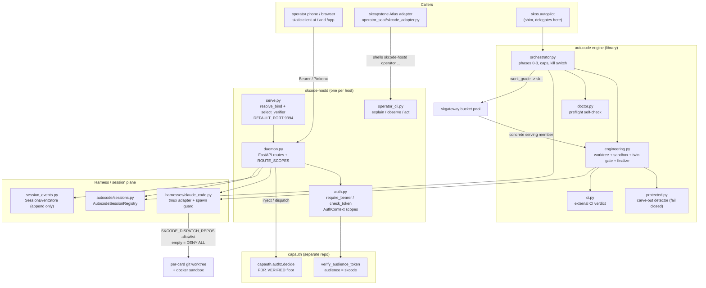
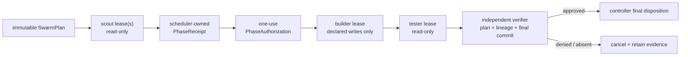

# skharness - Standard Operating Procedures

`skharness` is SKWorld's **execution plane**. It is two things in one distribution: the
capauth-gated `skcode-hostd` daemon (a tailnet-only FastAPI remote-control surface over
agent sessions) and the **autocode engine** library (the assess/plan/build/grade/finalize
loop that `skos autopilot` delegates to). Callers are the operator's phone/browser client,
Atlas's skcode adapter in `skcapstone`, and `skos.autopilot`.

> This SOP is the operational source of truth. Design documents live under
> [`docs/superpowers/specs/`](./docs/superpowers/specs/) and
> [`docs/specs/`](./docs/specs/); they are historical and some predate the current write
> surface. Where a spec and this SOP disagree, trust the code and this file.

---

## 1. Overview

**Purpose.** Let a human drive a swarm of coding agents from a phone over the tailnet,
with no third-party relay, and let the autocode engine drive the same agents unattended
behind a merge gate.

**What it owns.**

- `skcode-hostd`: the per-host daemon. One host, one `Harness` (the claude-code tmux
  adapter), one bound tailnet address on port **9394**.
- The **session plane**: session descriptors, the append-only `SessionEvent` store, and
  the merged view of interactive sessions plus autocode orchestrator runs.
- The **authorization enforcement point (PEP)** for that surface: bearer check, scope
  split, and a `capauth.authz.decide` call for the two RCE-class capabilities.
- The **autocode engine** (`src/skharness/autocode/`): work-item routing, the sandboxed
  build, the twin gate (grade plus external CI), the constitutional carve-out detector,
  and finalize/automerge.
- The sandbox build contexts under `docker/sandbox/` (claude, claude-flutter, opencode,
  pi, proxy).

**What it explicitly does NOT do.**

- It is **not** a policy decision point. It never decides authorization itself: capauth
  is the PDP, this daemon is the PEP. No authorizer configured means dispatch is denied
  (`501`), never allowed.
- It **generates, stores, and wraps no key material.** Crypto here is **verify only**:
  `serve.build_capauth_verifier` base64url-decodes the wire token, `import_token`s it, and
  calls capauth's `verify_audience_token` (`src/skharness/serve.py:96-107`). Identity,
  issuance, and revocation belong to [capauth](https://github.com/smilinTux/capauth).
- It is **not** the coordination board. Cards, epics, and ITIL records live in
  `skcoord`/`skcapstone`; the engine reads and writes them through the
  `skcapstone.coordination` shim.
- It is **not** a public service. There is no `:443` route, no Cloudflare Tunnel, and no
  Funnel exposure. See section 5, Front-end / Exposure.
- It provides minimal public `/livez` and `/readyz` routes. `/livez` reports only
  process serviceability. `/readyz` returns 503 unless every dependency configured as
  required for the arena is positively observed; an unknown required GPU is unready.

---

## 2. Architecture



### Start here

| File | Why it is the entry point |
|---|---|
| `src/skharness/serve.py` | The `skcode-hostd` entry point. `resolve_bind()` refuses a wildcard bind, `select_verifier()` picks real capauth or the fail-closed deny-all, `_serve()` wires every provider into the app. Read this first. |
| `src/skharness/daemon.py` | Every HTTP/WS route, plus `PUBLIC_ROUTES` and `ROUTE_SCOPES`: the authoritative statement of which route needs which scope. |
| `src/skharness/harnesses/claude_code.py` | The one harness the daemon owns. `parse_repo_allowlist()` and the `spawn()` guard are where dispatch is actually permitted or refused. |
| `src/skharness/autocode/orchestrator.py` | The engine's phase loop, caps, and kill switch. `skos.autopilot` delegates here by object identity. |
| `src/skharness/autocode/engineering.py` | The merge choke point: worktree, sandbox, grade, twin gate, `finalize()`. Nothing merges without passing through it. |
| `src/skharness/autocode/buckets.py` | Mechanical, fail-closed mapping from a complete card `work_grade` to the SKGateway bucket id carried as the per-call model override. |

Continual improvement and the production Pi execution image are governed by
[`docs/architecture/continual-harness.md`](./docs/architecture/continual-harness.md).
That design keeps execution, verification, refinement, and optional training as
separately versioned planes and records the canonical coordination epic (`4aca533c`).
The proposed controlled experiment service, Pi worker profiles, independent verifier,
artifact lineage, and phased release gates are specified in
[`docs/architecture/evolution-arena.md`](./docs/architecture/evolution-arena.md). It is
design-only until its named cards and evidence gates pass; this SOP does not claim an
operational arena.

---

## 3. Build

Pure Python, `setuptools` plus `setuptools_scm`. No compilation step.

```bash
git clone https://github.com/smilinTux/skharness && cd skharness
python -m pip install -e ".[dev]"
```

Fleet service installs use the owned operational venv. ML, TTS, security tooling,
and desktop-audio packages must not be installed into it:

```bash
./systemd/install-skops-runtime.sh
~/.venvs/skops/bin/python -m pip check
```

The installer resolves `skos` at the fleet-standard `~/clawd/skos`, then falls back to
a repository sibling; override explicitly with `SKOS_REPO=/absolute/path`.

Distribution build (what CI's `build` job runs):

```bash
python -m pip install build twine
python -m build
python -m twine check dist/*
```

**Always clone with tags.** The version is derived by `setuptools-scm` from the newest
`v<major>.<minor>.<patch>` tag (`[tool.setuptools_scm]` pins `tag_regex` and
`git_describe_command` to that shape, so the repo's non-SemVer tags such as
`swarm-20260717` cannot hijack the version). A shallow or tagless checkout produces a
placeholder like `0.1.dev1`. Every CI checkout therefore sets `fetch-depth: 0` and
`fetch-tags: true`.

**Sandbox images** are built separately and are not part of the Python build:

```bash
./docker/sandbox/build.sh
```

The Pi Dockerfile has `pi-core`, `pi-polyglot`, and `pi-python-test` targets. The Wolfi base image
digest, exact direct APKs, exact Pi version, and complete npm transitive integrity lock are recorded in
`docker/sandbox/pi/dependencies.lock.json`; both targets run as UID/GID `10001`, and
`docker/sandbox/build.sh pi` deliberately builds `pi-core` as `sandbox-pi:1`.

```bash
docker build --target pi-core -t skharness-pi-core:dev \
  -f docker/sandbox/pi/Dockerfile .
docker build --target pi-polyglot -t skharness-pi-polyglot:dev \
  -f docker/sandbox/pi/Dockerfile .
docker build --target pi-python-test -t skharness-pi-python-test:dev \
  -f docker/sandbox/pi/Dockerfile .
```

Those local commands intentionally install `skharness==0.0.0+local` and label the
image with tag `local`, revision `unknown`, and build mode `development`. This is an
honest non-release fallback, not a releasable identity. The tag workflow is the only
supported release path: it supplies `SKHARNESS_BUILD_MODE=release`, an exact
`SKHARNESS_VERSION`, matching `SKHARNESS_RELEASE_TAG=v<version>`, and the full
`SKHARNESS_REVISION`. The Docker build rejects empty, `0.0.0`, dev/local-qualified,
tag-mismatched, and non-full-commit release inputs before installing the package.

Use `pi-core` only for minimal runtime/qualification work. `pi-python-test` is the
project-qualified SKHarness coding image: its hash lock includes the declared dev
extras (`pytest-asyncio`, `pytest-mock`, and `httpx`) plus the released CapAuth,
SKCapstone, SKCoord, SKMemory, and JSON-schema import surface used by the suite. The
`arena-build` profile executes `skharness-pi-python-test-preflight` before admission;
the probe imports that surface and loads the required pytest plugins. A bare `pytest`
binary is not sufficient. Do not bootstrap a virtualenv in
`/tmp`: deployments may correctly mount temporary storage `noexec`, and dependency
installation during a verified run is outside the frozen environment contract.

Image qualification may also declare an executable behavior check. These checks run
with no network and a read-only root filesystem before admission; a non-zero result
fails closed with its bounded diagnostic. This is stronger than `command -v`, which
only proves that a filename exists.

For a linked Git worktree, the sandbox resolves the `.git` pointer and its `commondir`
before launch. The repository common Git directory is mounted at its original absolute
path **read-only**, while `/work` remains writable. This permits `git status`, diff, and
object/ref reads but deliberately denies commits, branch/ref mutation, and other Git
metadata writes from the worker. Malformed, missing, or escaping worktree metadata is
rejected before Docker networking or worker startup.

### Sandbox resource ownership and crash reconciliation

Each managed worker, egress proxy, and internal network carries the same immutable
`io.skharness.run-id` plus `io.skharness.managed=true`, lifecycle-schema, and exact
resource-role and ownership-authority labels. Arena uses its active scheduler lease ID
as the run ID and marks that authority as `lease`; direct sandbox launches mint a
non-secret random ID with `ephemeral` authority. This identity is the only authority
for crash reconciliation. Names such as `sbxrun-*` and `arena-proxy-*` are diagnostic
and must not be used to infer ownership.

The first live admission performs reconciliation, and later admissions repeat it at a
bounded interval (300 seconds by default). Operators/controllers may call
`Sandbox.reconcile_orphans(active_run_ids=...)` explicitly and read the bounded result
from `Sandbox.reconciliation_status()`. The production Arena composition supplies all
active scheduler lease IDs automatically.

Reconciliation inventories only resources with the managed label and removes them by
their exact Docker IDs only when the complete run group is older than the default
900-second bootstrap grace. A running ephemeral worker or declared active lease
preserves the entire group. Arena reconciliation treats its supplied lease inventory
as authoritative, so a running worker whose old lease disappeared is reclaimed after
the grace period; other callers without that authoritative view fail closed on
lease-owned resources. Young groups, unparseable creation evidence, malformed
ownership, an oversized inventory, and networks with foreign attachments fail closed
and remain for inspection. Errors and counters are bounded; `partial`, `error`, or
`inventory_truncated` is not successful cleanup evidence. Normal `finally` teardown
remains the fast path: it independently attempts worker, proxy, and network removal,
accepts already-absent resources idempotently, and reports failure only after all three
attempts. Reconciliation exists for controller kill, host restart, and other cases
where that teardown never ran.

The live Arena supervisor bounds every Docker control call to three seconds. Orphan
reconciliation has a three-second aggregate deadline; project-image preflight allows
30 seconds aggregate and checks cancellation between its individually bounded probes;
network/proxy startup allows nine seconds aggregate. Preflight containers reuse the
worker's exact name and immutable ownership labels, so a timed-out probe is covered by
the same exact cleanup. OOM inspection timeout, non-zero inspect, or malformed state is
`docker_supervisor_error`, never an inferred `OOMKilled=false`. Exact worker/proxy/network
cleanup is at most nine seconds. Docker's reserved launch-failure exit `125` is recorded
as `docker_launch_error` with its original stderr and is not OOM-inspected because the
worker container may never have existed. `cancel()` is bounded by one three-second Docker
removal plus five seconds of process grace, and the qualification runtime's 20-second
drain is one monotonic deadline spanning both `cancel()` and the remaining quiescence wait.
End-to-end worker usage is likewise charged from monotonic elapsed time; UTC
`started_at`/`finished_at` remain audit fields and a backwards wall-clock step is clamped
without reducing the charge.

Pi process status is not sufficient completion evidence. SKHarness also reads the
structured event stream: `message_end.message.stopReason=error` classifies the attempt
as `pi_terminal_error` even if Pi exits zero. A wall-time expiry remains a timeout with
partial evidence. Operator-run tests may validate the resulting patch, but must not be
treated as an autonomous successful finish.

For card-driven Pi runs, declare `CardSize.SMALL`, `MEDIUM`, or `LARGE` and use the corresponding
bounded assess/inspect/build/test policy. The runner hard-caps wall time at the phase
sum and persists requested/served model, card size, duration, time-to-first-edit (only
when present in Pi events), and timeout phase. Durable event artifacts deduplicate
adjacent canonical envelopes and replace oversized payloads with a digest; raw logs stay
in the attempt directory. Route models with `EvidenceModelRouter` only from a fixed
trial set containing S/M/L evidence for each candidate. No successful target-size trial
means no route; operators must not substitute intuition for missing qualification data.

The `arena-build` launch spec applies `InspectionScope(root="/work")` with measured
discovery ceilings of 24/48/80 calls for S/M/L cards.
Filesystem discovery through Pi's `find`/`grep`/`ls` tools or through bash (`find`,
`grep`, `rg`, `ls`) is monitored from structured tool-start events. Absolute paths
outside `/work`, parent traversal, malformed discovery commands, and attempts exceeding
the call budget terminate the container and produce `inspection_denied` evidence. Do
not loosen this to accommodate a broad search. Shell inspection is command-aware:
only discovery-command arguments and `cd` destinations are path checked, so regex
syntax in neighboring `sed`/`awk` commands is not treated as a path.

### Orchestrated Pi teams

Use `SwarmTopologyPolicy` before allocating workers. S cards remain a single builder
unless inspection proves independent workstreams; M cards use scout -> builder ->
tester; L/cross-repository cards may use up to two read-only scouts followed by one
builder and one tester. Multiple isolated builders remain disabled until a trusted
controller-owned integration/cherry-pick stage can join divergent commits. The trusted
`TrustedSwarmOrchestrator` owns ordering and delegates only immutable
`SubagentContract` objects bound to the card hash, base commit, evidence ID, trajectory
ID, plan, phase, lease, worktree, paths, tools, and child budget.



The plan declares the exact phase DAG and contract cardinality before the first lease.
Every non-root admission consumes a one-use authorization minted from scheduler-owned
predecessor receipts. A downstream contract therefore binds the exact prior result,
receipt, evidence, typed scout findings, and commit hashes. Scouts must end with a
machine-parsed `SCOUT_ASSESSMENT` and bounded repository-relative `SCOUT_FINDING`
records co-located in the final assistant message. The controller appends literal valid
forms and the outcome mapping to every scout prompt; headings and findings must be
unadorned normalized lines, not bullets, Markdown, fences, or trailing prose. Positive
assessments require a concrete 12–500 character finding on an ASCII-segmented normalized
repository-relative path. Exit zero, an earlier assistant message, or generic prose
cannot mint build authority. Typed finding fields are handed to the next Pi prompt as
controller-bound observations, not authority: receipt hashes bind their exact bytes but
do not establish truth, and worker-authored `detail` remains explicitly untrusted data
that cannot issue commands, widen scope, change roles, or alter the required output.

`SwarmScheduler` reserves the entire child budget before launch, rejects overlapping
writes in one worktree, heartbeats leases without extending hard deadlines, persists
stop requests, and recovers its content-checked checkpoint after restart. The runtime
must kill every lease returned by cancellation/timeout and acknowledge that stop.
Parent/child assignment and result messages are appended to the A2A journal; sibling
or unrelated-agent messaging is not valid under these contracts. Raw terminal usage is
retained even when it exceeds the reservation or arrives after timeout; bounded ledger
settlement is stored separately. A timeout, cancellation, overage, missing result, or
wrong phase cardinality stops downstream admission and remains negative across restart.

Never complete a card from worker prose, exit zero, or worker-authored tests.
`SwarmCompletionGate` derives the expected result set from the immutable plan and
requires a trusted independent signature over the plan hash, canonical receipt-lineage
digest, unique final commit, exact planned result hashes, and verifier-observed evidence
for every criterion. A worker's negative `blocked`, `needs_input`, or `failed` report
may ratchet trust downward; its `completed` report is evidence only and has no promotion
authority.

The 2026-08-21 `.41` L-card trial found incident `1df443cb`: two scouts reached their
hard deadlines without terminal results, the old empty-result check treated the phase
as successful, and a builder was admitted without scout evidence. That run is failed
evidence, not qualification. The invariant is now pinned by
`test_missing_timed_out_scout_results_never_admit_builder` plus authorization,
late-result, restart, and verifier-lineage tests. The corrected `.41` rerun at commit
`3bfe5b4` admitted only the two read-only scouts. Both were stopped by their bounded
inspection policy, no builder/tester assignment, phase receipt, or downstream
authorization was issued, completion remained denied, all measured usage was settled,
no worker container remained, and the worktree stayed clean. The signed-off measurements
and raw-evidence hashes are in `docs/evidence/1df443cb-pi-swarm-41.md`. This closes the
fail-open incident; it does not complete the separate S/M/L quality evaluation.

Passing `capability_profile=` to `PiAdapter` loads only the in-image SK bridge extension
and emits Pi's explicit `--tools` allowlist. The extension calls
`skharness-pi-bridge`, whose Python policy independently denies operations absent from
the selected profile. A runtime controller must mount an absolute backend executable
and set `SKHARNESS_SK_BRIDGE_BACKEND`; no backend credentials or sovereign agent home
are baked into either image.

Direct APK versions are pinned in `apt-packages.lock`; Python runtime and test
dependencies are transitively pinned with hashes in `requirements.lock` and the
reviewable `test-requirements.in` -> `test-requirements.lock` pair. A release tag
publishes, capability-probes, keyless-signs, verifies, and vulnerability-scans all
three targets, including `pi-python-test`, by immutable digest. `scripts/qualify-arena.py`
emits an explicitly unsigned local
evidence bundle, and `scripts/pi-supply-chain.sh` requires Syft and Grype to generate a
CycloneDX SBOM and vulnerability report (optionally signing provenance with Cosign).
The script applies the reviewed `docker/sandbox/pi/openvex.json`, retains its reports,
and exits non-zero for every unaccounted Critical or High match. Each VEX statement is
bound to an exact package PURL and upstream patch or supported not-affected evidence;
generating an SBOM is never treated as a passing vulnerability gate. The core runtime
omits npm, pip, setuptools, compilers, and test-only dependencies after its multi-stage
build. Package inventory evidence uses Python package metadata rather than requiring a
runtime package installer.
Its default remains offline. Operators may add `--live-gateway URL` and provide the
credential only through `SKGATEWAY_API_KEY` (or the environment-variable name selected
by `--gateway-api-key-env`) to record health/models probes, redacted generated Pi
configuration, gateway attribution, and the Pi container's response model and output.
For the frozen transport gate, also pass `--expected-output VALUE` and optionally
`--arena-store PATH`. The default `--pi-workers 2` is a hard minimum: each Dockerized
worker must have a distinct attributed gateway request and immutable experiment, and
each must independently verify as valid. The qualifier persists content-addressed
Experiment/Result and assistant-output artifacts, independently repeats exact-output
observations, and admits
only the verified-valid Pi result to the Pareto frontier. It also executes a planted
false-output result claiming score `999999999`; a live claim fails unless that control
is invalid and excluded. This narrow gate proves execution, evidence, and admission
plumbing only. It is not a semantic-quality evaluator and does not replace private,
operator-owned challenge verification.

The host-side `skharness-sk-backend` provides exact-schema SKCapstone/SKMemory and arena
operations for the worker bridge. Arena/scratch writes are idempotent files; an
idempotency-key collision fails rather than overwriting evidence. Runtime launch still
must mount this executable and scoped SK credentials/home explicitly.

Fresh 2026-08-20 Wolfi builds are locally runtime-, confinement-, and vulnerability-
qualified: core and polyglot each report zero unaccounted High/Critical Grype matches,
and polyglot proves Node/npm, Python/uv, Go, Rust/Cargo, and Java. Live qualification
observes distinct direct and Pi SKGateway request IDs, backend, served model, and
immutable Experiment/Result records. `.41` is the Intel/iGPU fleet node; do not require
NVIDIA telemetry there. `.100` is the RTX 5060 Ti GPU/model node and passed a real
CUDA 13 Docker `nvidia-smi` probe (16,311 MiB VRAM, driver 580.173.02). Each release
must still regenerate and verify its immutable registry digest, SBOM/provenance,
signature, vulnerability report, and full Arena evidence bundle.

Tag pushes run `.github/workflows/pi-image.yml`: all three targets are published to GHCR by
immutable digest with BuildKit SBOM/provenance, keyless-signed using GitHub OIDC, and
immediately signature-verified. A separate Anchore job consumes the reviewed OpenVEX
document and fails on any remaining High or Critical;
publication or signing success cannot turn a failed vulnerability gate green.
The workflow accepts only an exact `vMAJOR.MINOR.PATCH` tag whose peeled commit equals
`GITHUB_SHA`. It passes that version, tag, and commit into every image target. The same
values drive installed Python metadata, the baked `image-provenance.json`, and OCI
`version`, `ref.name`, and `revision` labels. Before signing `pi-python-test`, the
preflight compares its externally supplied expected version with both the baked record
and `importlib.metadata.version("skharness")`; any disagreement fails closed.

Release `v0.3.36` exercised that path for all three targets, including
`pi-python-test`. Registry digest
`sha256:f8fbc2f8733aae10ebaf3c8f268c9d4e004ccf34db2e5f0458452548b3f3acd3`
was built with SBOM/provenance attestations, capability-probed, keyless-signed,
identity/issuer-verified, and passed the Grype High/Critical gate. `.41` then pulled
that exact digest and passed the then-current capability-only preflight under the
confined runtime contract. The probe also reported `skharness=0.0.0`; that broke the
package-to-tag provenance join and invalidated the image for reuse despite the valid
digest, signature, and scan. See
`docs/evidence/7fe0fb6b-pi-python-test-v0.3.36.md`. A replacement tag must pass the
version-aware workflow and be digest-pulled and requalified on `.41` before this
incident can close. Release `v0.3.37` completed that replacement gate. Its qualified
`pi-python-test` digest is
`sha256:e7268563898230b39ca512d3614a9263c19bde79d9e1193d1c595d971aec1dfa`;
the package metadata, baked record, OCI labels, tag and full commit agree, and a
mismatched expected version fails closed. See
`docs/evidence/cd4bf7fb-pi-image-provenance-v0.3.37.md`.

Arena admission CPU and RAM reservations become Docker `--cpus`, `--memory`, and
no-extra-swap cgroup limits. Both worker and egress proxy use read-only root filesystems,
dropped capabilities, `no-new-privileges`, PID limits, and bounded resources. Run the
real confinement proof against the Pi image using the command below.

When Arena mode is enabled, configure exact SKGateway and verifier health URLs. GPU
workers additionally require `SKHARNESS_ARENA_SERVING_BACKEND_HEALTH_URL`; missing or
unknown GPU/backend telemetry fails readiness. Scheduled and on-demand maintenance must
call `ArenaJobService.run` so both paths write the same durable job ledger. The host
deployment is responsible for its timer and for injecting incident/alert callbacks;
the read-scoped `/api/v1/arena/runs`, `/jobs`, and `/failures` routes expose the result.

```bash
RUN_SANDBOX_IT=1 SANDBOX_TEST_IMAGE=sandbox-pi:1 \
  python -m pytest -q tests/test_sandbox_confinement_it.py
```

The Pi provider release gate is stricter than the host-level mock contract. Pull an
already-qualified image by digest, then run the opt-in container test with that exact
reference:

```bash
docker pull \
  ghcr.io/smilintux/skharness-pi-python-test@sha256:e7268563898230b39ca512d3614a9263c19bde79d9e1193d1c595d971aec1dfa
RUN_PI_GATEWAY_CONTAINER_IT=1 \
PI_GATEWAY_TEST_IMAGE=ghcr.io/smilintux/skharness-pi-python-test@sha256:e7268563898230b39ca512d3614a9263c19bde79d9e1193d1c595d971aec1dfa \
  python -m pytest -q tests/test_pi_container_gateway_it.py
```

The test rejects mutable image references. It runs both the Python-stdlib mock gateway
and real Pi worker from the supplied digest on a unique Docker `--internal` network,
checks the requested model, card/session attribution, provider-owned response model and
assistant output, and makes a raw public-IP connection from that same worker fail. It
removes both containers and the network even after a failed assertion. No gateway or
registry credential is needed after the digest has been pulled.

The trusted S/M/L Pi swarm qualification is a separate, operator-started gate. Its
driver freezes canonical CardStore content hashes, source commit, image digest, route,
model, prompts, paths, tools, topology, and per-worker budgets. Preflight is the default;
only `--execute` starts workers, and execution is pinned to `.41`. The driver never
updates the coordination board or grants completion authority.

```bash
skharness_qual_image='ghcr.io/smilintux/skharness-pi-python-test@sha256:8e991c893e7553522369a35d10b78ae2e831eb62b9f127ba53a7dabd045e2c7d'
skharness_qual_controller="$(git rev-parse HEAD)"
test -z "$(git status --porcelain --untracked-files=all)"
# Review both immutable inputs before continuing. The controller commit is the
# current trusted driver/runtime source, not the older frozen worker-base commit.
git show --no-patch --format='%H %s' "$skharness_qual_controller"
python scripts/qualify-pi-swarm.py \
  --image "$skharness_qual_image" \
  --controller-commit "$skharness_qual_controller" \
  --output /tmp/pi-swarm-v038-preflight.json

# Run on .41 only after explicit operator authorization. Use a new evidence root.
skharness_qual_stamp="$(date -u +%Y%m%dT%H%M%SZ)"
python scripts/qualify-pi-swarm.py \
  --execute \
  --image "$skharness_qual_image" \
  --controller-commit "$skharness_qual_controller" \
  --evidence-root "/home/cbrd21/.skcapstone/qualification/pi-swarm-v038-${skharness_qual_stamp}"
```

Do not substitute `coord kanban --json` for the canonical
`~/.skcapstone/cards/<id>/core.json` snapshots: the folded kanban view deliberately
omits acceptance criteria. Any content mismatch, mutable image reference, wrong host,
dirty source/worktree, existing evidence root, out-of-scope edit, failed controller
test, or missing phase result fails closed. The L card remains two read-only scouts;
there is no cross-repository builder until all repositories and fresh transport evidence
can be bound immutably. Retain the detached worktrees for review. Do not equate their
provisional commits, Pi exit zero, or worker-authored tests with card completion.

The preflight verifies that the driver, its critical imported modules, and the release
evidence record are tracked bytes from the exact reviewed controller commit; that commit
must descend from the frozen worker source. Before execution it also verifies the local
image RepoDigest and v0.3.38 OCI labels. Every card is separated by an all-managed-label
Docker inventory gate. Controller pytest and Ruff containers have unique lifecycle
labels, no network, fixed resource and wall-clock limits, cancellation-aware bounded
exact-name cleanup, and a post-cleanup zero-resource assertion. Builder leases reserve
180 seconds inside the immutable contract wall: 90 pytest + 10 cleanup + 30 Ruff + 10
cleanup + six 5-second hookless/signing-disabled Git commands + 10 seconds overhead.
Pi receives only the serialized remainder, and its phase budget sums exactly to that
remainder. Cancellation sets the lease token, cancels Pi, drains validation and host Git,
and must prove runtime quiescence before stop acknowledgement or the next card. Any
launch, timeout, cleanup, inventory, quiescence, or source-drift uncertainty prevents
admission of the next card. The final evidence bundle is sealed only after quiescence
and contains a detached SHA-256 inventory of its files.

Measured model, token, tool, duration, and cost fields remain `null` with a reason when
provider/controller artifacts cannot prove them. The scheduler is still charged the
full reservation for every unknown dimension (`accounting_basis: reservation`), but
reserved charges are never reported as observed performance. This driver measures
swarm execution and phase gating only. It has no matched single-agent baseline,
independent quality verdict, or complete TTFE/denial attribution, so its output cannot
close comparison card `322f2d80`.

Continual-loop comparisons use `skharness.arena.evaluation`. A report is valid only
when every baseline, memory-only, skills-only, subagents-only, and full-loop cell is
present for the declared fixed seeds and repetition count. The report always includes
quality, cost, tokens, latency, recovery rate, reward-hack count, and verifier
disagreement count; duplicate or missing cells fail closed.

RL exports preserve exact token IDs, logprobs, sampling parameters, model identity,
and action/observation boundaries. Only assistant/action steps are labeled for RL;
tool responses and observations are labeled for world-model SFT. Slow parametric
promotion requires distinct train/eval/prod dataset IDs and credential IDs, a passing
held-out regression, a passing canary, zero observed reward hacks, and an explicit
approval identifier. Validate these invariants with:

```bash
python -m pytest -q tests/test_arena_evaluation.py
```

Pi attribution has two distinct sources. Request/card IDs are injected headers;
served-model evidence is read only from Pi's provider-owned assistant
`message_end.responseModel` events. `HarnessResult.model_requested` is resolved
through the same `PiAdapter._effective_model` call used by both the command line and
generated `models.json`. `HarnessResult.model_served` aggregates only assistant
`message_end.responseModel` evidence: all calls reporting the same non-blank model is
observed; distinct models are conflict; and a reported model plus an assistant call
without one is partial. Conflict and partial both leave the model null with a closed
reason. Any malformed, truncated, or non-event nonblank stream line makes the run
incomplete and null unless distinct observed models already establish conflict.
The scanner accepts only the exact Pi 0.84.2 `JsonAgentSessionEvent` type vocabulary;
unknown types and `message_end` envelopes without a recognized message object/role are
incomplete. User/tool messages never count. Parsed assistant JSON is bound only to its own
event's response model; controller-owned requested/served/backend/request fields are
stripped from top-level, nested, event-stream, and single-object assistant replies.
The requested model is never used as a fallback. Pi JSON mode does not expose
SKGateway response headers: its `provider` names the configured provider and its
`responseId` is an upstream response identifier, so neither may be relabeled as
`backend_served` or `gateway_req_id`.
Those fields remain `None` with closed, field-specific unobserved reasons until an
adapter-owned response-header observation exists. The live `.41` evidence for this
transport is `docs/evidence/0172231c-live-41.md`; it predates the aggregation,
closed-reason, and all-shape sanitization contract above and is not live proof of those
new semantics.
The qualification bundle retains Pi stdout as `pi.raw_event_stream` so a card can
prove the provider metadata was present; generated provider configuration and
authorization headers are never written to that stream or bundle.

---

## 4. Test

The green bar is `.github/workflows/ci.yml` on push and pull request against `main`.
`publish.yml` deliberately does not gate on tests, so **CI is the only place the suite
runs**. Four jobs, all of which must pass:

| Job | What it proves |
|---|---|
| `lint` | `ruff check src/ tests/` on Python 3.12. |
| `test` | The anti-skip gate, then the full suite on 3.12 with the **real siblings** installed. |
| `compat-3-10` | The package and the autocode core import cleanly on the declared `requires-python` floor, plus the sibling-free unit tests. |
| `build` | `python -m build` and `twine check dist/*`. |

### The anti-skip gate (the part worth knowing)

`tests/test_autopilot_failure_memory_roundtrip.py` spans two repos: `skcoord` owns the
card writer, `skharness` owns the reader. Those tests **self-skip** when the sibling is
missing, which is correct on a dev box and wrong in CI, where running them is the entire
point. The job therefore captures the pytest output and **fails if it contains the word
`skipped`**:

```bash
out="$(python -m pytest tests/test_autopilot_failure_memory_roundtrip.py -q -rs 2>&1)"
grep -qi "skipped" <<<"$out" && exit 1
```

A skipped gate reports green while checking nothing. This one cannot.

### Sibling install order is load-bearing

CI installs `skos`, `capauth`, `skcapstone`, then **`skcoord` LAST with `--upgrade`**.
`skcapstone` depends on `skcoord>=0.1.0`, which pulls the released PyPI wheel; that wheel
lags `main` and can be missing the very API under test. Installing `skcoord` from git
`main` last is what makes the job test merged code rather than a stale release. Do not
reorder those lines.

### Local run

```bash
python -m pytest tests/ -q                       # everything installed here
python -m pytest tests/test_daemon.py -q         # route + auth behaviour
python -m pytest tests/test_route_coverage.py -q # every live route is classified
python -m pytest tests/test_systemd_unit.py -q   # the shipped unit keeps its safety defaults
python -m pytest tests/test_autocode_buckets.py tests/test_adapter_pi.py \
  tests/test_autopilot_config_harness.py -q      # graded dispatch + precedence
```

### Graded model-selection gate

The card's `work_grade` is written in phase 0 as either `None` or one complete mapping
containing `size`, `risk`, `sensitivity`, and `model_class`. The routing path consumes
that stored decision; it does not grade again:

1. `bucket_for_payload()` maps `model_class` plus `sensitivity` to the exact lowercase
   `sk-<class>-<sensitivity>` grammar.
2. `EngineeringExecutor` attaches that value to every build and grader brief.
3. Only an adapter declaring `supports_model_override()` may receive it. Today that is
   the Pi adapter; unsupported adapters refuse instead of silently ignoring the grade.
4. The per-call bucket wins over the adapter's static model for that invocation. With
   no grade, no override is sent and the static sovereign model remains unchanged.
5. The grader is pinned through `grader_bucket()` so it cannot grade its own class; the
   twin gate and protected-path decision remain independent of the routing field.

A partial/corrupt grade or malformed bucket raises `BucketError`. It never falls back
to a looser model. This matches SKGateway's 12-address grammar and closes the historical
near-miss path where an invalid `sk-*` string could resolve through `sk-auto`.

`tests/test_route_coverage.py` is the structural gate on the auth model: it enumerates the
**live app route table** and asserts every served route is declared either in
`PUBLIC_ROUTES` or in `ROUTE_SCOPES`. A new gated route cannot ship unclassified.

Secrets are covered separately by `.github/workflows/secret-scan.yml` (the gitleaks
binary, full history, `--exit-code 1`). See [SECURITY.md](./SECURITY.md).

---

## 5. Release / Deploy

### Library release (PyPI)

`.github/workflows/publish.yml`, Trusted Publishing (OIDC, `owner=smilinTux`,
`workflow=publish.yml`, `environment=pypi`). No PyPI token exists in the publish path.

1. Merge to `main`. The `tag` job cuts the **next patch tag** itself, ranking all
   `v*.*.*` tags by version (`sort -V`), never `git describe`, so a release can never go
   backwards.
2. `build` refuses to publish a tag that is not an ancestor of `origin/main`, and refuses
   any version containing `+`, `dev`, or `0.0.0`.
3. `pypi-publish` uploads the artifact.

**Never push a tag by hand.** Pushing `v*` triggers a publish directly.

For a fleet release, push the reviewed `main` commit and let `publish.yml` create the
next patch tag. Verify the workflow-created tag before pulling nodes. On each node:

```bash
git -C ~/clawd/skcapstone-repos/skharness fetch --tags origin
git -C ~/clawd/skcapstone-repos/skharness status --short
git -C ~/clawd/skcapstone-repos/skharness pull --ff-only origin main
~/clawd/skcapstone-repos/skharness/systemd/install-skops-runtime.sh
systemctl --user restart skcode-hostd
systemctl --user is-active skcode-hostd
```

Stop before pull when the checkout is dirty; never overwrite node-local work to make a
deployment look clean.

For an editable tagged deployment such as `.41` card `0146f13f`, prove that Git, package
metadata, and the imported module all name the same release before restarting anything.
The operational venv is authoritative; do not use a user-site install or restart an
unaffected service.

```bash
skharness_repo=/home/cbrd21/clawd/skcapstone-repos/skharness
skharness_venv=/home/cbrd21/.venvs/skops
skharness_venv_python="$skharness_venv/bin/python"
skharness_tag=v0.3.39

test -z "$(git -C "$skharness_repo" status --porcelain --untracked-files=all)"
git -C "$skharness_repo" fetch --tags origin
skharness_tag_commit="$(git -C "$skharness_repo" rev-parse "${skharness_tag}^{commit}")"
git -C "$skharness_repo" merge --ff-only "$skharness_tag_commit"
test "$(git -C "$skharness_repo" rev-parse HEAD)" = "$skharness_tag_commit"

SKOPS_VENV="$skharness_venv" \
  "$skharness_repo/systemd/install-skops-runtime.sh"
"$skharness_venv_python" -m pip check
SKHARNESS_DEPLOY_TAG="$skharness_tag" \
SKHARNESS_DEPLOY_REPO="$skharness_repo" \
  "$skharness_venv_python" - <<'PY'
import importlib
import os
from importlib.metadata import version
from pathlib import Path

expected = os.environ["SKHARNESS_DEPLOY_TAG"].removeprefix("v")
repo_src = (Path(os.environ["SKHARNESS_DEPLOY_REPO"]) / "src").resolve()
module_path = Path(importlib.import_module("skharness").__file__).resolve()
assert version("skharness") == expected
assert module_path.is_relative_to(repo_src), (module_path, repo_src)
PY

systemctl --user restart skcode-hostd
skcode_livez_url="http://$(tailscale ip -4):9394/livez"
skcode_probe_ok=0
for skcode_probe_attempt in $(seq 1 30); do
  if curl -fsS "$skcode_livez_url" >/dev/null; then
    skcode_probe_ok=1
    break
  fi
  sleep 1
done
test "$skcode_probe_ok" = 1
systemctl --user is-active --quiet skcode-hostd
test -z "$(git -C "$skharness_repo" status --porcelain --untracked-files=all)"
```

Use the owned installer for the tagged path as well as ordinary fleet updates. Python
3.12 operational venvs need not carry `setuptools.build_meta`; the installer uses an
isolated build environment for editable metadata, installs the declared service/SKOS
dependencies, and runs `pip check` plus both CLI probes. Do not replace it with a direct
`pip install --no-deps --no-build-isolation`: that both requires build tooling in the
runtime venv and can omit a newly declared runtime dependency. The exact tag/package/
module-path assertions above remain the release-identity gate before restart.

Record the exact tag/commit and the metadata/module-path assertions without printing
the service environment or any credential. On 2026-08-21, `.41` passed the original
contract at `v0.3.38` / `2e8e4d89aac1967fb297c0558b311998a9bc1e9a`, then
passed the corrected owned-installer contract at `v0.3.39` /
`1b9b4b5bb55df02ec33872af2448b464f0f20807` after the direct no-build-isolation
attempt stopped before restart.

The two current qualification targets have deliberately different roles. Do not infer
GPU capability from an address or reuse one node's readiness criteria for the other:

| Node | Hardware role | Required deployment validation |
|---|---|---|
| `192.168.0.41` | Intel CPU/iGPU control and service node | Fast-forward GitHub pull, owned-runtime install, affected-service restart, liveness/readiness, and Intel/iGPU-safe execution. NVIDIA telemetry is optional and must not gate readiness. |
| `192.168.0.100` | NVIDIA RTX 5060 Ti 16 GiB model/GPU node | Fast-forward GitHub pull, exact signed image digest, affected-service restart, `nvidia-smi`/container GPU visibility, attributed SKGateway model response, and bounded-concurrency evidence. |

Record the pre-deploy commit, post-deploy commit/tag, effective unit or image digest,
restart result, and health evidence. A code pull alone is not a deployment. If either
node is dirty, unreachable, cannot fast-forward, or fails readiness, leave the prior
service running where safe and open/update an incident with the observed evidence.

The Arena qualifier intentionally does not require a host-global `pi` executable.
Pi is an image-owned, integrity-pinned runtime: qualification checks its version inside
the selected image and the live gate executes every attributed worker through that
image. `tests/test_pi_mock_gateway_it.py` remains a CI contract test (CI provisions the
pinned fixture explicitly), but it is not part of the fleet host preflight.

### Service deploy (`skcode-hostd`)

The unit is a **systemd user unit**, installed from the repo and never auto-started.

```bash
./systemd/install.sh --diff      # show drift between repo and installed unit
./systemd/install.sh             # install unit + env template + daemon-reload
mkdir -p ~/.config/skcode-hostd
cp ~/.config/skcode-hostd/skcode-hostd.env.example ~/.config/skcode-hostd/skcode-hostd.env
$EDITOR ~/.config/skcode-hostd/skcode-hostd.env     # set the tailnet IP + host id
systemctl --user enable --now skcode-hostd
systemctl --user status skcode-hostd
journalctl --user -u skcode-hostd -f
```

Effective `ExecStart` on the deployed node (`noroc2027`):

```
/home/cbrd21/.venvs/skops/bin/python -m skharness --host ${SKCODE_HOSTD_TAILSCALE_IP} --port 9394 --host-id ${SKCODE_HOSTD_HOST_ID}
```

Note that the deployed unit runs `python -m skharness` (`src/skharness/__main__.py`),
which imports `serve.main`. The `skcode-hostd` console script from
`[project.scripts]` is the same function; the operator facet is reached as
`skcode-hostd operator ...`.

Two drop-ins are live on that node and are part of the deploy, not decoration:

| Drop-in | Effect |
|---|---|
| `skcode-hostd.service.d/resource-limits.conf` | `MemoryHigh=6G`, `MemoryMax=8G`, `OOMPolicy=kill` (takes the whole cgroup, so a runaway child cannot orphan), `CPUQuota=200%`, `TasksMax=1024`. |
| `skcode-hostd.service.d/restart-storm.conf` | `RestartSteps=8`, `RestartMaxDelaySec=5min`. Backoff, not a start limit: this unit must never permanently die. |

Always read the **effective** unit before believing the repo copy:

```bash
systemctl --user cat skcode-hostd
systemctl --user show skcode-hostd -p ExecStart -p DropInPaths
```

Unit hardening shipped in `systemd/skcode-hostd.service`: `NoNewPrivileges=true`,
`ProtectSystem=strict`, `ProtectHome=read-only`, `PrivateTmp=true`, with
`ReadWritePaths=%h/.skharness %h/.skcapstone` as the only writable home paths.

**Rollback.**

```bash
systemctl --user stop skcode-hostd                     # immediate: the surface goes away
./systemd/install-skops-runtime.sh                    # rebuild the owned runtime
systemctl --user restart skcode-hostd
```

The daemon holds no durable state of its own beyond files under
`~/.skcapstone/skcode/` (audit log, worktrees, session events), so stopping it is always
safe. To disarm without stopping, set `SKCODE_FORCE_DENY_ALL=1` in the env file and
restart: every caller is then denied and nothing actuates.

### Front-end / Exposure

- **Tier: internal, tailnet only.** Not public.
- **Public `:443` routes: none.** This service is never fronted by Cloudflare, never
  Funnel-exposed, and has no reverse-proxy vhost.
- **Bind address: a Tailscale IP, enforced in code.** `serve.resolve_bind()` raises
  `SystemExit("skcode-hostd refuses to bind a wildcard/public address")` on a blank value
  or on anything in `_WILDCARD = {"0.0.0.0", "::"}` (`src/skharness/serve.py:27,54-60`).
  The unit sources `--host` from `${SKCODE_HOSTD_TAILSCALE_IP}`, so a **missing or empty
  env value fails the unit closed rather than exposing a port**. This is deliberate and
  should not be "fixed" by adding a fallback default.
- **Port: 9394** (`serve.DEFAULT_PORT`). `:9390` belongs to
  `skcomms.transports.broker_server`, hence the offset. Override with `--port` and record
  it in `~/.skcapstone/docs/PORTS.md`.
- **Static client and probes:** `GET /`, `GET /app`, public discovery, `/livez`, and
  `/readyz` are the only unauthenticated HTTP routes. Probes expose dependency classes
  and states, never experiment, lease, run, card, route, or credential identities.

---

## 6. Configuration / Usage

### Daemon environment

`EnvironmentFile=%h/.config/skcode-hostd/skcode-hostd.env`. Template:
`systemd/skcode-hostd.env.example`.

| Key | Required | Meaning |
|---|---|---|
| `SKCODE_HOSTD_TAILSCALE_IP` | yes | The tailnet IP to bind. Blank or wildcard fails the unit closed. |
| `SKCODE_HOSTD_HOST_ID` | yes | Node id reported by `GET /api/v1/hosts/self` (for example `.158`). |
| `SKCODE_DISPATCH_REPOS` | no (**empty = deny all**) | Comma-separated absolute repo roots that `POST /dispatch` may target. See below. |
| `SKCODE_REAL_VERIFIER` | no | Legacy explicit opt-in to the real capauth verifier. Since CR-3.2 real capauth is the **default**, so this is redundant but harmless. |
| `SKCODE_FORCE_DENY_ALL` | no | The escape hatch. Truthy forces the deny-all verifier: every caller denied. The only way to turn the real verifier off, and it still fails closed. |
| `SKCODE_FULL_PROFILE_SUBJECTS` | no | Comma-separated subjects allowed to dispatch the `full` profile (real identity, real `HOME`, MCP). Default `lumina@chef.skworld.io`. Everyone else is sandbox-only. |
| `SKCODE_STATE_DIR` | no | Root for audit log, worktrees, and session events. Default `~/.skcapstone/skcode`. |
| `SKCODE_CRON_LEDGER_PATH` | no | Overrides the ledger `GET /api/v1/jobs` reads. Default `~/.skcapstone/logs/cron-ledger.jsonl`. |
| `SKCODE_WATCHDOG_DIGEST_PATH` | no | Overrides the artifact `GET /api/v1/watchdog/digest` reads. Default `~/.skcapstone/watchdog/digests/latest/digest.json`. |
| `SKHARNESS_ARENA_ENABLED` | no | Truthy makes SKGateway and verifier health required readiness signals. |
| `SKHARNESS_ARENA_SKGATEWAY_HEALTH_URL` | arena | Exact SKGateway health URL. Missing is `unknown`; only HTTP 2xx is ready. |
| `SKHARNESS_ARENA_VERIFIER_HEALTH_URL` | arena | Exact verifier health URL. Missing is `unknown`; only HTTP 2xx is ready. |
| `SKHARNESS_ARENA_REQUIRE_GPU` | no | With arena enabled, require successful `nvidia-smi` telemetry with at least one GPU. |
| `CLAUDE_CODE_OAUTH_TOKEN` | node-local | The credential the spawned agent uses. It lives only in this env file, never in the repo. |

### The dispatch allowlist, and why `skos` and `skharness` are not on it

`POST /api/v1/dispatch` can spawn a **new agent session**, which is remote code execution.
The repo allowlist is the last gate before that happens.

- `parse_repo_allowlist()` (`src/skharness/harnesses/claude_code.py:141`) realpaths every
  entry, so `..` and symlink games do not defeat membership.
- An unset or empty `SKCODE_DISPATCH_REPOS` yields `[]`, and `spawn()` treats `[]` as
  **DENY ALL** (`claude_code.py:908`: `raise SpawnRejected("repo allowlist is empty
  (SKCODE_DISPATCH_REPOS unset): deny all")`). A fresh install can dispatch nothing until
  an operator explicitly lists a repo. `systemd/skcode-hostd.env.example` deliberately
  ships without the key.
- **`skos` and `skharness` must never be added.** They are the self-modification hazard:
  `skharness` is the code that enforces the twin gate, the carve-out detector, and this
  very allowlist, and `skos` is the autopilot that drives it. An agent dispatched into
  either could edit its own leash, and the change would be graded by the code it just
  edited. The enforcement today is **purely the deployed env value**, so this rule lives
  in the operator's head and in this document. There is no code-level exclusion list;
  treat any PR that adds one of these two paths as a security change.
- The live value on `noroc2027` is exactly three repos: `skchat`, `skworld-app`,
  `skcapstone`.
- `GET /api/v1/dispatch/targets` reports the same list, advisory only. `POST /dispatch`
  re-enforces it in the spawn guard.

### Autocode engine configuration

Separate file, read by the library rather than the daemon:
`~/.skcapstone/config/autopilot.yaml`, overridable with `SKOS_AUTOPILOT_CONFIG`, and
resolved under `SKCAPSTONE_HOME` when set (`src/skharness/autocode/config.py:24-31`).
**A missing file yields a disabled default, so a fresh box never auto-runs.** Caps
(`Caps` in `config.py`) bound concurrency, new tasks per run, tokens per run, USD per day,
and decomposition depth and breadth.

### Operator usage

```bash
skcode-hostd operator explain     # the operator-facet contract, JSON
skcode-hostd operator observe     # current conditions, JSON
skcode-hostd operator act pause-dispatch            # emergency brake, POST /dispatch -> 503
skcode-hostd operator act pause-dispatch --resume   # re-arm
skcode-hostd operator act archive-stale-session --session <sid>
skcode-hostd operator act restart-hostd
```

`kill-runaway-session` is deliberately **not** a standard action: it is irreversible, so
the CLI refuses and reports the escalation instead of acting.

---

## 7. API / Reference

Every route below is served by `daemon.build_daemon_app`. The scope column is
`ROUTE_SCOPES` verbatim (`src/skharness/daemon.py:110-125`); it is the authoritative
mapping, and `tests/test_route_coverage.py` fails if a live route is missing from it.

| Method | Path | Scope | Purpose |
|---|---|---|---|
| GET | `/.well-known/skworld-module.json` | public | Module manifest. |
| GET | `/` , `/app` | public | The self-contained static client. |
| GET | `/livez` | public | Process liveness only; it does not imply dependency readiness. |
| GET | `/readyz` | public | Required store/SKGateway/verifier/GPU readiness; 503 on required error or unknown. |
| GET | `/api/v1/hosts/self` | `skcode.stream` | Host and harness identity. |
| GET | `/api/v1/arena/status` | `skcode.stream` | Derived attempt counts, scheduler capacity, and dependency status. |
| GET | `/api/v1/arena/challenges` | `skcode.stream` | Immutable challenge summaries. |
| GET | `/api/v1/arena/attempts` | `skcode.stream` | Bounded structured attempt-state records. |
| GET | `/api/v1/arena/leases` | `skcode.stream` | Active lease records; identities never become metric labels. |
| GET | `/api/v1/arena/verifications` | `skcode.stream` | Bounded independent-verification records. |
| GET | `/api/v1/arena/frontier` | `skcode.stream` | Valid-only multi-objective Pareto frontier. |
| GET | `/api/v1/arena/lineage/{experiment_id}` | `skcode.stream` | Parent, ancestor, reproduction, and descendant view. |
| GET | `/api/v1/arena/metrics` | `skcode.stream` | Fixed-cardinality operational metrics. |
| GET | `/api/v1/sessions` | `skcode.stream` | Live and historical sessions, harness plus autocode runs merged. |
| GET | `/api/v1/sessions/{sid}` | `skcode.stream` | One session, or 404. |
| GET | `/api/v1/sessions/{sid}/events` | `skcode.stream` | Replay from the append-only event store. |
| GET | `/api/v1/jobs` | `skcode.stream` | A read-through view of the cron ledger. Never a store. |
| GET | `/api/v1/watchdog/digest` | `skcode.stream` | The published skwatchdog digest bytes, served unparsed. |
| GET | `/api/v1/dispatch/targets` | `skcode.dispatch` | Advisory list of dispatchable repos. |
| POST | `/api/v1/sessions/{sid}/ratify` | `skcode.inject` | Runs the twin gate over the session's existing worktree diff. Grades only: never commits, merges, or pushes. |
| POST | `/api/v1/sessions/{sid}/inject` | `skcode.inject` | Sends operator text into a running session's PTY as keystrokes. |
| POST | `/api/v1/sessions/{sid}/deny` | `skcode.inject` | Records an operator denial for a pending decision. |
| POST | `/api/v1/dispatch` | `skcode.dispatch` | Spawns a NEW agent session. The RCE surface. |
| POST | `/api/v1/sessions/{sid}/cancel` | `skcode.dispatch` | Cancels a dispatched session. |
| WS | `/api/v1/sessions/{sid}/stream` | `skcode.stream` | Typed `SessionEvent` stream. Token rides `?token=` because browsers cannot set headers on a WebSocket. |

### The write surface is real, and how it is gated

The daemon **does** have a write surface. Anything claiming otherwise is stale. Four
independent gates stand in front of it, and each fails closed:

1. **Bearer.** `auth.require_bearer` rejects a missing or empty token before the verifier
   runs.
2. **Token verification.** `serve.build_capauth_verifier` requires a valid, signed,
   unexpired, `skcode`-audience capauth token. Any parse or verify error returns `False`.
   If capauth cannot be imported, `select_verifier()` falls back to **deny all**, so a
   broken capauth install denies every caller rather than crashing or opening.
3. **Scope split.** A verified token grants only the scopes it carries. `skcode.stream`
   is read-only. Writing needs `skcode.inject`; spawning needs `skcode.dispatch`. A
   read-only token can view everything and actuate nothing.
4. **PDP decision.** `skcode.inject` and `skcode.dispatch` additionally go through
   `capauth.authz.decide` at a `VERIFIED` enrollment floor, so the floor is enforced in
   code and not only at token issuance. Dispatch also requires a configured audit sink
   (no sink means `501`), honours the persisted pause flag (`503`), and restricts the
   `full` profile to `SKCODE_FULL_PROFILE_SUBJECTS`.

`PDP_SCOPES` in `daemon.py` names exactly which scopes must carry a `capauth.authz`
`DEFAULT_RULES` row. `skcode.stream` is deliberately excluded: it is scope-only.

### Constitutional carve-out (`autocode/protected.py`)

The engine can rewrite almost anything autonomously except the machinery that constrains
it. `protected.py` is a **path-level** detector, because a test cannot catch a diff that
deletes the freeze check (such a diff still passes).

- Any manifest load failure returns `_FAIL_CLOSED = {"protected": ["**"]}`
  (`protected.py:24`): a missing, unreadable, unsigned, or empty
  `objects/_protected.json` protects **everything**, so a tampered manifest cannot open
  the gate.
- `_ALWAYS_PROTECTED` (`protected.py:29-42`) is a hardcoded floor that holds even under a
  valid but incomplete manifest. It covers `skharness/autocode/protected.py` (the
  detector itself), `skharness/autocode/engineering.py` (the automerge choke point),
  `skcapstone/fleet/store.py`, `skcapstone/itil.py`, `objects/_protected.json` (the
  manifest), and `objects/_freeze.json` (the kill switch).
- A diff touching any of those escalates to a human **regardless of grade or green CI**.
- **Where it runs (corrected 2026-08-16, card 53e9190c).** Until S17 the detector had
  exactly one call site, inside `if automerge:` in `engineering.py`, and
  `automerge_repos` is `[]` in all four live configs, so the carve-out never executed.
  The doc above described a mechanism that was inert. It is now evaluated on **every**
  `finalize`, before the diff is offered for merge by any route, and every evaluation
  writes a `carveout_evaluated` health event carrying the matched paths. A PR-only
  review decision that touches the floor says so in its prompt.
- **What the real control is.** Auto-merge being off fleet-wide
  (`automerge_repos: []`) is still what keeps every build in front of a human. The
  carve-out is the backstop for the day that flag flips, which is exactly why it must not
  be reachable only through the flag it is meant to survive.
- **The manifest half is human-signed.** As of the 2026-08-20 governed Chef
  rotation, live `objects/_protected.json` and `objects/_freeze.json` verify
  against Chef fingerprint `ADAD14CCAC8D6D0BF5A4209DB994E78200BF6422`.
  Signing preserves the freeze value; it does not unfreeze ATLAS. The
  `skharness-sign-plane-files` ceremony pins both signing and self-verification
  to the explicit operator CapAuth home, because an active agent seat has a
  different valid trust roster. The prior implementation signed with Chef but
  self-checked against the active agent and refused the write; commit
  `edafcd0` adds the regression gate. A missing, invalid, or unverifiable
  manifest remains fail-closed under enforcement. Before this ceremony the
  manifest shipped with `"signature": null`; the hardcoded
  `_ALWAYS_PROTECTED` tuple remains the independent constitutional floor.
  Treat manifest entries as signed additive policy, never as permission to
  narrow that floor.

### Preflight self-check (`autocode/doctor.py`)

`doctor.check_shim_delegation()` verifies by **object identity** that
`skos.autopilot.orchestrator.run_once is skharness.autocode.orchestrator.run_once`
(`doctor.py:37-49`). A `fail` verdict means that node is running pre-extraction autopilot
code and every `skos autopilot run` there silently ignores the shared engine and all its
fixes. Other checks cover the agent credential, the sandbox image, and docker
availability. Checks never raise into a run: a broken check yields a `warn` or `fail`
verdict, not an exception.

---

## 8. Troubleshooting

| Symptom | Check |
|---|---|
| Unit fails at start, journal shows "refuses to bind a wildcard/public address" | Working as designed. `SKCODE_HOSTD_TAILSCALE_IP` is blank, `0.0.0.0`, or `::` in `~/.config/skcode-hostd/skcode-hostd.env`. Set a real tailnet IP: `tailscale ip -4`. |
| Every API call returns 401 | The token is missing, malformed, expired, or not `skcode`-audience. Also check `SKCODE_FORCE_DENY_ALL` is not set: truthy forces deny-all. `journalctl --user -u skcode-hostd` shows the reject. |
| Reads work, `POST /inject` returns 403 | Scope split behaving correctly. The token carries `skcode.stream` but not `skcode.inject`. Reissue with the write scope, and confirm the subject is `VERIFIED` in capauth (the PDP floor). |
| `POST /dispatch` returns 501 | No authorizer or no audit sink configured. `build_dispatch_authorizer()` returned `None`, which means capauth could not be imported in the daemon's venv. Fix the install; do not work around it. |
| `POST /dispatch` returns 503 | The emergency brake is engaged. `skcode-hostd operator act pause-dispatch --resume` clears it. |
| `SpawnRejected: repo allowlist is empty (SKCODE_DISPATCH_REPOS unset): deny all` | Correct fail-closed behaviour on a fresh install. Add the intended repo roots to `SKCODE_DISPATCH_REPOS` and restart. Never add `skos` or `skharness` (section 6). |
| `SpawnRejected: repo ... is not on the dispatch allowlist` | Path mismatch after realpath. Compare `realpath` of your value with the env entry; a symlinked or relative path will not match. |
| `skos autopilot run` behaves like an old build, fixes have no effect | Stale delegation. Run the doctor check: `python -c "from skharness.autocode.doctor import check_shim_delegation as c; print(c())"`. A `fail` means `skos.autopilot` is not delegating to `skharness` on this node; reinstall/rsync the `skos.autopilot` shim package there. This is a known failure CLASS documented in `autocode/doctor.py:1-12`, not a written-up incident. |
| `operator observe` reports everything healthy but the daemon is down | Known gotcha, and it is deliberate. `_default_probe()` fails **safe**: any failure (connection refused, 401, malformed body) returns the all-healthy state so the operator loop never pages falsely (`operator_cli.py:38,180-206`). Do not use `observe` as a liveness probe. Use `systemctl --user is-active skcode-hostd`. |
| `/readyz` returns 503 while `/livez` is 200 | The process serves, but a required arena dependency is error/unknown. Inspect the reported states and configuration; do not restart-loop merely because readiness is false. |
| CI red on "the cross-repo round trip SKIPPED instead of running" | `skcoord` did not install from git `main`, so the round-trip tests self-skipped. Check the sibling install step, especially that `skcoord` is installed LAST with `--upgrade`. |
| A build gets escalated at grade 5 with green CI | Expected if the diff touched a carve-out path. Check it against `_ALWAYS_PROTECTED` and `objects/_protected.json`. A missing or malformed manifest protects everything by design. |
| A graded card uses the adapter's static model | Confirm the card payload carries a complete `work_grade`, the configured adapter returns `supports_model_override() == True`, and `graded_dispatch` appears in health events. Pi supports the override; other adapters intentionally refuse it. |
| A bucket-shaped model is rejected before dispatch | Inspect `model_class` and `sensitivity`. Only lowercase `sk-(s|m|l|xl)-(public|internal|secret)` leaves `buckets.py`; partial grades and near-miss ids fail closed. |
| An ungraded card uses a bucket | This is a defect. `bucket_for_payload()` must return `None`, leaving the adapter's static sovereign model unchanged. `sk-s-secret` exists only as an explicit future floor, not the default path. |
| Daemon OOM-killed or the whole cgroup died | `resource-limits.conf` did its job (`MemoryMax=8G`, `OOMPolicy=kill`). Inspect the build that ran away before raising the limit. |
| Installed unit does not match the repo | `./systemd/install.sh --diff`. Remember drop-ins are separate files: read `systemctl --user cat skcode-hostd` for the effective unit. |
| `pip install` reports Click/Typer conflicts | Effective `ExecStart` must name `~/.venvs/skops/bin/python`; rebuild with `install-skops-runtime.sh` and run its `pip check`. Do not repair it by changing ML packages. |

---

## 9. Maturity-tier + Version reference

- **Maturity-tier: operational.** The daemon runs enabled on `noroc2027` with real
  capauth verification and a three-repo dispatch allowlist. The autocode engine is
  exercised by the full CI suite on every PR.
- **Crypto maturity tier: T0 (verify only, delegated).** `skharness` generates, stores,
  and wraps **no key material**. Its entire cryptographic footprint is one call into
  capauth's `verify_audience_token` over an already-issued token
  (`src/skharness/serve.py:96-107`), plus the `AuthContext`/`Verifier` seam in
  `src/skharness/auth.py`. It performs no key exchange, no KEM, no signature generation,
  and no negotiation of its own. **No post-quantum claim is made or implied here**; the
  posture of the tokens it verifies is capauth's to state, not this repo's.
- **Security posture: not independently audited.** The authorization model, the twin
  gate, and the carve-out detector are operational and tested in-repo, but no external
  security review has been performed. The sandbox is isolation for accidents, not a
  hostile-code boundary: treat agent-authored code as untrusted input to review, not as
  contained. See [SECURITY.md](./SECURITY.md).
- **Version:** do not quote a number here. The version is derived by `setuptools-scm`
  from the newest `v*.*.*` git tag (`[tool.setuptools_scm]` in `pyproject.toml`), and a
  release tag is cut automatically by `publish.yml` on a push to `main`. Read it with
  `python -m setuptools_scm` in a checkout with tags, or `pip show skharness` on an
  installed node. Release history: [CHANGELOG.md](./CHANGELOG.md).
- **License:** GPL-3.0-or-later ([LICENSE](./LICENSE)).
- **Self-report / evidence:** `skcode-hostd operator explain` prints the operator-facet
  contract and `skcode-hostd operator observe` prints the current conditions, both JSON
  (`src/skharness/operator_cli.py:373-374`). Remember that `observe` fails safe, so pair
  it with `systemctl --user is-active skcode-hostd` before trusting a healthy verdict.

---

## Unverified / needs an operator pass

- **Token issuance.** This SOP documents how a `skcode`-audience capauth token is
  *verified*. The command an operator runs to *mint* one, with `skcode.stream` versus
  `skcode.inject` versus `skcode.dispatch` scopes, belongs to capauth and was not
  verified here. An operator pass should add the exact mint command.
- **Whether any device currently holds a write-scoped token.** The daemon is running with
  real verification, but the population of issued tokens and their scopes was not
  enumerated.
- **The sandbox images' provenance and rebuild cadence.** `docker/sandbox/build.sh`
  exists; which images are current on which node was not checked.
- **The `skos` shim deployment state fleet-wide.** `doctor.check_shim_delegation()`
  detects staleness per node; it was not run across the fleet as part of this pass.

<!-- docs-evidence
verified: 2026-08-22
checks:
  - name: console entry point still points at skharness.serve:main
    run: grep -q 'skcode-hostd = "skharness.serve:main"' pyproject.toml
  - name: documented default port 9394 matches the code
    run: grep -q '^DEFAULT_PORT = 9394$' src/skharness/serve.py
  - name: wildcard bind is still refused in code
    run: grep -q '_WILDCARD = {"0.0.0.0", "::"}' src/skharness/serve.py && grep -q 'refuses to bind a wildcard/public address' src/skharness/serve.py
  - name: shipped unit ExecStart still matches the documented invocation
    run: grep -qF 'ExecStart=%h/.venvs/skops/bin/python -m skharness --host ${SKCODE_HOSTD_TAILSCALE_IP} --port 9394 --host-id ${SKCODE_HOSTD_HOST_ID}' systemd/skcode-hostd.service
  - name: owned runtime installer carries capauth and checks both CLIs
    run: grep -qF 'service = ["capauth>=0.3.1,<0.4"]' pyproject.toml && grep -qF 'python" -m pip check' systemd/install-skops-runtime.sh && grep -qF 'bin/skos" --help' systemd/install-skops-runtime.sh
  - name: the documented write surface actually exists
    run: grep -q '@app.post("/api/v1/sessions/{sid}/inject")' src/skharness/daemon.py && grep -q '@app.post("/api/v1/dispatch")' src/skharness/daemon.py
  - name: scope split constants match the documented scope names
    run: grep -q 'SCOPE_READ = "skcode.stream"' src/skharness/daemon.py && grep -q 'SCOPE_WRITE = "skcode.inject"' src/skharness/daemon.py && grep -q 'SCOPE_DISPATCH = "skcode.dispatch"' src/skharness/daemon.py
  - name: dispatch allowlist still defaults to empty (deny all)
    run: grep -q 'SKCODE_DISPATCH_REPOS", ""' src/skharness/harnesses/claude_code.py && grep -q 'repo allowlist is empty' src/skharness/harnesses/claude_code.py
  - name: carve-out detector still fails closed
    run: grep -q '_FAIL_CLOSED: dict = {"protected": \["\*\*"\]' src/skharness/autocode/protected.py
  - name: truthful arena liveness and readiness routes remain declared
    run: grep -q '@app.get("/livez")' src/skharness/daemon.py && grep -q '@app.get("/readyz")' src/skharness/daemon.py && grep -q '("GET", "/readyz")' src/skharness/daemon.py
  - name: CI anti-skip gate is still armed
    run: grep -q 'the cross-repo round trip SKIPPED instead of running' .github/workflows/ci.yml
  - name: graded dispatch maps only the canonical twelve bucket addresses
    run: grep -qF 'BUCKET_CLASSES: tuple[str, ...] = ("s", "m", "l", "xl")' src/skharness/autocode/buckets.py && grep -qF 'BUCKET_SENSITIVITIES: tuple[str, ...] = ("public", "internal", "secret")' src/skharness/autocode/buckets.py
  - name: per-call model override is capability-gated and Pi opts in
    run: grep -qF 'if not self.supports_model_override()' src/skharness/autocode/adapters/base.py && grep -qF 'def supports_model_override(self) -> bool:' src/skharness/autocode/adapters/pi.py
  - name: ungraded work does not construct or attach a bucket
    run: grep -qF 'if grade is None:' src/skharness/autocode/buckets.py && grep -qF 'return None' src/skharness/autocode/buckets.py && grep -qF 'dispatch_model = self._dispatch_model(item)' src/skharness/autocode/engineering.py
  - name: continual harness architecture and canonical epic remain discoverable
    run: test -f docs/architecture/continual-harness.md && grep -qF 'Canonical epic: `4aca533c`' docs/architecture/continual-harness.md
  - name: Pi swarm phase admission remains evidence-bound and verifier-gated
    run: grep -qF 'class PhaseAuthorization' src/skharness/arena/swarm.py && grep -qF 'def record_phase_receipt' src/skharness/arena/swarm_control.py && grep -qF 'def phase_lineage_digest' src/skharness/arena/swarm_verifier.py && grep -qF 'test_missing_timed_out_scout_results_never_admit_builder' tests/test_arena_swarm_orchestrator.py
-->
