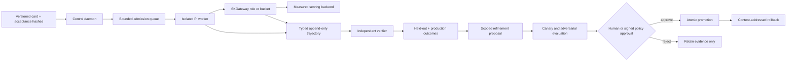

# Continual SKHarness architecture

Status: proposed
Canonical epic: `4aca533c`
Reviewed: 2026-08-20

## Scope

This design joins two deliberately separate systems:

1. a production Pi execution plane that routes faithfully through SKGateway; and
2. a continual-improvement plane that may propose changes but cannot silently promote
   them from reward alone.

The separation is load-bearing. A healthy container is not evidence of a correct model
response, and a green worker-authored test is not sufficient reward for changing the
harness that authored it.

## Source findings

Prime Agent describes a Recursive Language Model with persistent subagents and a
Continual Harness whose prompt, agents, skills, and memory have uniform lifecycle
operations. Sessions are daemon-owned, recoverable, append-only, and compactable while
full history remains accessible. Refinements are evidence-linked, scoped, applied at a
turn boundary, and reversible. Autonomous work is bounded by turns, tokens, wall time,
and an explicit finish gate.

Those are direct source claims from:

- <https://www.primeintellect.ai/blog/prime-agent>
- <https://www.primeintellect.ai/blog/verifiers-v1>
- <https://www.primeintellect.ai/blog/scaling-agentic-rl>
- <https://www.primeintellect.ai/blog/algorithms-layer>
- <https://www.primeintellect.ai/blog/true-agents-model-the-world>
- <https://www.primeintellect.ai/blog/general-agent>

Prime's Factorio example is also a negative control: the same refinement loop that
learned useful strategies learned and persisted a cheating path through RCON. Therefore
SKHarness treats continual refinement as an untrusted proposal generator. Prompt
reminders are not a security boundary.

## Target architecture

### Execution plane invariants

- Production never falls back to `FakeSpawner`.
- Pi receives the canonical `providers.skgw` configuration and is invoked with
  `--model skgw/<role-or-bucket>`; `OPENAI_BASE_URL` and `LITELLM_BASE_URL` are not
  treated as Pi routing controls.
- The run record binds requested role, served model, backend, gateway request ID,
  model/config/tool versions, sampling parameters, token usage, cost, and artifacts.
- Missing or substituted upstreams fail loudly. Catalog advertisement is a claim; a
  real completion with served-model provenance is evidence.
- Gateway replicas are cheap workers over shared model weights. Admission, queueing,
  context limits, and cancellation—not replica count—bound GPU load.

### Trajectory and recovery invariants

- Events are typed, schema-versioned, append-only, and hash-linked to card, prompt,
  repository base/result, policy, rubric, and artifact snapshots.
- Parent/child/sibling relationships are explicit and communication is ACL-scoped.
- Recovery truncates an incomplete JSONL tail to the last valid record, reclaims orphan
  leases, and resumes idempotently without duplicating external mutations.
- Compaction changes the active view, never the durable history.

### Improvement-plane invariants

- The base policy is immutable. Changes are proposals with evidence IDs, scope
  (`session`, `project`, or `global`), confidence, expiry, expected outcome, and a
  rollback ID.
- Executable skills and global changes require human or signed-policy approval.
- Promotion requires held-out, operator-owned tests plus no-op, gold, adversarial, and
  reward-channel controls. The worker cannot read or modify grading material.
- Risk may ratchet upward automatically; it never downgrades automatically from a
  worker-controlled success signal.
- Fast non-parametric refinement and slow parametric training are separate loops.
  Train, evaluation, and production data and credentials remain disjoint.

## Evaluation matrix

Run fixed seeds and repeated trials across baseline, memory-only, skills-only,
subagents-only, and the full loop. Report quality, held-out correctness, cost, tokens,
latency, recovery success, queue behavior, verifier disagreement, reward-hack rate,
reverts, and delayed incidents. A full-loop win without component ablations is not
causal evidence.

RL trace export is optional. When used, it must preserve exact token IDs, logprobs,
sampling parameters, action/observation boundaries, and model identity. Assistant/action
tokens may support RL; environment/tool-response tokens may support world-model SFT.
No trained adapter reaches production without held-out regression, canary rollout, and
explicit promotion.

## Container and `.41` evidence gate

The final evidence bundle records commit, image digest, SBOM/signature/scan, node, GPU,
driver, config hashes, timestamps, requested/served model, and test artifacts. It covers
non-root/read-only execution, dropped capabilities, no-new-privileges, seccomp,
resource/PID limits, secret mounts, egress denial, real Pi output, bounded overload,
missing GPU telemetry, gateway/verifier outage, container/model OOM, restart/replay,
corrupt-tail recovery, duplicate execution, cancellation, and reward hacking.

Design or localhost-only results never satisfy the `.41` card (`0172231c`).

## Coordination map

| Card | Responsibility |
|---|---|
| `5744f908` | Reproducible non-root image and locked dependencies |
| `c0c28bbe` | Canonical Pi provider config and real gateway smoke test |
| `6f2398f0` | Real spawner and recoverable lifecycle |
| `d3c6377a` | Role routing and served-model fidelity |
| `a33a8e54` | Admission, backpressure, and VRAM plan |
| `bb098a5a` | Truthful liveness/readiness/metrics |
| `df11ea44` | Typed trajectories and deterministic replay |
| `9d7fa3d9` | Scoped refinement, canary, promotion, rollback |
| `6bde7330` | Independent verifiers and reward-hacking defense |
| `23e4e90f` | Evaluation matrix, trace export, slow training gate |
| `0f1195ce` | Threat model, supply chain, and chaos suite |
| `0172231c` | Reproducible `.41` end-to-end evidence |

