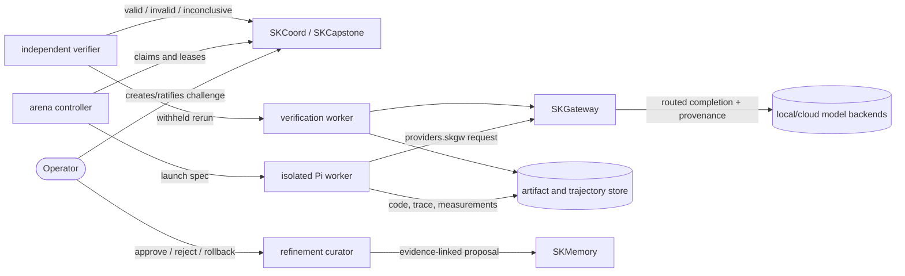
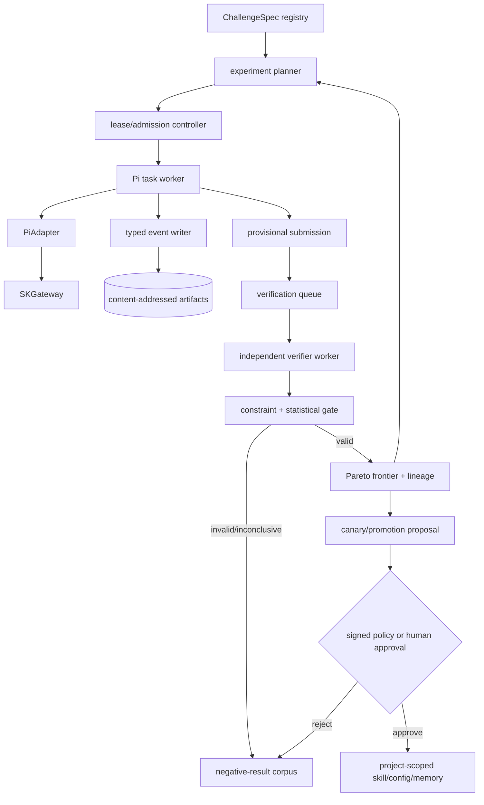
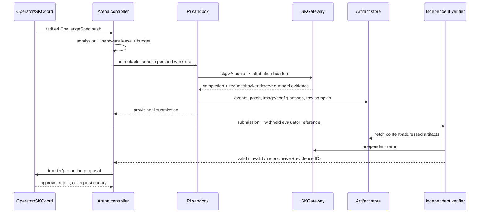

# SKHarness Evolution Arena

Status: proposed; implementation is not yet claimed
Canonical parent epic: `4aca533c`; arena epic: `82673f16`
Research snapshot: 2026-08-20
Owners: SKHarness execution plane; SKCoord board; SKGateway model plane

## 1. Decision

Build a sovereign, agent-agnostic **Evolution Arena** around Pi as the strategic
coding harness and SKGateway as the only model-routing plane. The arena turns a
versioned challenge into many isolated experiments, independently verifies their
artifacts, and promotes only reproducible Pareto improvements.

This is an evaluation and artifact-evolution loop, not permission for a worker to
rewrite its own grader or production policy. It extends, and is constrained by,
[`continual-harness.md`](./continual-harness.md).

The first release targets software-engineering and inference-serving challenges on
local fleet nodes. It must be model-, agent-, repository-, and hardware-agnostic:
Gemma/A10G is the research case, while Pi/SKGateway/Qwen/chiap08 and `.41` are our
initial implementation environment.

## 2. Research basis and limits

### Direct observations from the Fast Gemma Challenge

The [Fast Gemma Challenge](https://huggingface.co/gemma-challenge) fixes the model and
GPU, requires text/image/audio preservation, ranks output throughput, and uses
perplexity as a quality guardrail. Agents publish structured Markdown result records,
share techniques through a message board, and receive a separate organizer
verification state. The [dashboard source](https://huggingface.co/spaces/gemma-challenge/gemma-dashboard/blob/main/README.md)
documents the result-per-file and per-agent-inbox design; the
[public evaluation prompts](https://huggingface.co/datasets/gemma-challenge/eval-prompts)
are distinct from organizer verification prompts.

The public result API contained 718 parseable submissions at the research snapshot:
40 valid, 99 invalid, 578 pending, and one agent-run result. A stock BF16 vLLM result
reported 43.997 TPS at PPL 2.3018; the highest valid result reported 510.838 TPS at
PPL 2.3930 on the same A10G class, about 11.6 times the baseline. The progression
combined quantization-aware serving, speculative/multi-token decoding, graph capture,
sliding attention, split-KV verification, vocabulary pruning, fused kernels, warm-up,
and repeated reproduction. These numbers are a dated observation of the challenge
API, not an SKHarness benchmark or a claim that they transfer to another GPU/model.

The invalid set includes deliberately absurd TPS values and plausible high-throughput
runs that failed the quality ceiling. That is direct evidence that public,
self-reported metrics need explicit trust states and independent reruns.

### Inferences adopted by SKHarness

- The reusable pattern is a controlled experiment arena, not a Gemma-specific kernel.
- Shared positive and negative results act as non-parametric continual learning.
- Lineage and reproduction let agents recombine improvements without granting global
  write access or unrestricted A2A communication.
- A single leaderboard scalar is unsafe. SKHarness uses constraints plus a Pareto
  frontier and records distributions, not only the luckiest sample.
- Tournament data may later feed RL or distillation, but only after provenance,
  held-out evaluation, train/eval separation, and promotion controls exist.

## 3. System context



SKHarness owns experiment execution and verification orchestration. SKGateway owns
model selection, failover, usage, and served-model evidence. SKCoord owns the work
graph and mutation history. SKMemory stores approved, scoped lessons; it is not the
raw trajectory store. CapAuth supplies identity and authorization. SKWhisper is not a
default dependency: it is an optional voice/interaction adapter and requires its
service to be available.

## 4. Component design



### Required services and packages

1. `arena.specs`: immutable `ChallengeSpec` validation and content hashing.
2. `arena.experiments`: experiment state machine and parent/lineage graph.
3. `arena.scheduler`: hardware leases, admission, cancellation, budgets, retries,
   orphan reclamation, and idempotent resume.
4. `arena.runner`: Pi launch specifications and artifact collection.
5. `arena.verifier`: independently privileged reruns with withheld material.
6. `arena.metrics`: repeated-trial statistics and Pareto-front computation.
7. `arena.promote`: evidence-linked canary, approval, promotion, and rollback.
8. `arena.export`: typed trace and curated dataset export; never direct training.

The packages are logical boundaries, not necessarily separate processes in the first
sprint. The verifier must be a separate trust boundary before any result is called
valid.

## 5. Canonical contracts

### `ChallengeSpec` (`arena.challenge.v1`)

Required fields:

- `id`, `version`, `title`, `owner`, `created_at`, and canonical content hash;
- repository URL, base commit, writable paths, protected paths, and task template;
- model/tokenizer identifiers and immutable digests, allowed variants, required
  modalities, and expected served-model policy;
- hardware class, GPU count/VRAM, driver/runtime constraints, and image digest;
- public development dataset plus separately referenced withheld evaluator dataset;
- objective metrics, hard constraints, units, aggregation, warm-up, repetitions,
  seeds, and confidence rule;
- time/token/cost/energy/concurrency budgets;
- allowed/prohibited optimization classes and network/tool capabilities;
- verifier, rubric, policy, and schema versions;
- promotion and rollback requirements.

Changing a field creates a new version and hash. Results from different hashes never
share a frontier without an explicit compatibility transform.

### `Experiment` (`arena.experiment.v1`)

Required fields include experiment/parent IDs; challenge hash; actor and harness;
card and run IDs; repository base/result SHAs; image/SBOM digests; requested role or
bucket; requested and served model; gateway request/backend IDs; engine, kernel,
quantization and sampling configuration; seeds; hardware/driver telemetry; budgets;
timestamps; raw artifact hashes; metrics; verifier state and reason; and the Signed
Provenance Envelope fields required by `sk-standards`.

The state machine is:

```text
proposed -> admitted -> running -> provisional -> verifying
                                     |              |-> valid
                                     |              |-> invalid
                                     |              `-> inconclusive
                                     `-> failed / cancelled
```

Transitions are append-only events. Retry creates an attempt, never overwrites a
measurement. Reproduction cites the experiment it reproduces; mutation cites its
parent and changed dimensions.

### Result measurements

Store raw observations plus summary statistics. Depending on the challenge, dimensions
include correctness/pass rate, output TPS, TTFT, p50/p95/p99 latency, tokens, cost,
joules, VRAM peak, queue time, OOM/crash/retry rate, context behavior, modality tests,
policy compliance, verifier disagreement, reverts, and delayed incidents.

Promote by Pareto dominance under hard constraints. A `best_of_n` value is labeled as
such and cannot stand in for expected performance; mean, standard deviation, sample
count, seeds, warm/cold state, and confidence interval accompany it.

## 6. Critical sequence



## 7. Pi as the strategic harness

Pi is the default task worker because it has a compact CLI, custom-provider support,
skills, extensions, structured event output, and a programmatic SDK. This is a
strategic default, not an arena identity: `harness`, `agent`, and `model` remain
separate fields and the adapter interface stays open.

Pi must route through generated `models.json` using provider `skgw`, API
`openai-completions`, and `--model skgw/<role-or-bucket>`. The adapter already does
this and sets `supportsDeveloperRole: false`; environment variables such as
`OPENAI_BASE_URL` are not accepted as routing evidence. Every successful experiment
must join its Pi run to SKGateway's request ID, backend, and served model.

Pi does not provide a trusted built-in SK MCP surface merely because an MCP config is
present. SK tools must be exposed through a pinned Pi extension or a narrow CLI/tool
bridge, with schema parity tests and per-profile allowlists. Pi extensions execute
with the worker's OS authority, so an extension is part of the trusted computing base,
must be pinned and hashed, and cannot be downloaded dynamically during a run.

### Capability profiles

| Profile | Default tools | SK integrations | Intended use |
|---|---|---|---|
| `arena-build` | read/edit/write/bash, git, test toolchains | read-only card context; result append | untrusted experiment worker |
| `arena-verify` | benchmark/test runner only | verifier result append | independent held-out verification |
| `project-full` | Pi coding tools plus approved language tools | scoped SKCapstone and SKMemory | operator-approved project work |
| `operator` | explicitly granted tools | CapAuth-gated SK services | interactive human-supervised work |

`arena-build` is the default for challenge workers. It cannot complete cards, modify
criteria, read withheld tests, promote memory, change SKGateway policy, or mutate the
arena implementation. `project-full` is never selected by a benchmark result.

### SK service policy

- **SKCapstone/SKCoord:** include narrow read/claim/progress/result operations; shared
  board mutations carry resolved identity and provenance.
- **SKMemory:** default to read-only scoped recall plus an experiment-local scratch
  collection. Durable project/global writes are refinement proposals requiring the
  promotion gate.
- **CapAuth:** verifier/PEP integration, not broad worker credentials. Mount or inject
  short-lived scoped credentials at runtime; never bake them into an image.
- **SKWhisper:** optional profile only. Do not make every ephemeral worker depend on a
  voice service merely because SKMemory exists.

## 8. Pi worker image family

Create one reproducible multi-stage build with two published targets rather than one
unbounded kitchen-sink image:

### `skharness-pi-core`

- Debian trixie slim base pinned by index digest (with the amd64 manifest recorded);
  non-root UID/GID contract;
- Pi npm package and its complete transitive graph pinned with lockfile/integrity;
- git, ca-certificates, curl, `jq`, `rg`, `fd`, and process tools;
- Python 3 plus a locked virtual environment containing SKHarness client/bridge code,
  SKCapstone/SKCoord client, SKMemory client, and schema tooling;
- generated Pi config mount points; pinned SK Pi extension and skill bundle;
- OCI labels, SBOM, provenance, signature, and vulnerability report;
- no secrets, agent home, model weights, Docker socket, or mutable global cache.

Native build dependencies, pip/setuptools, npm itself, and test-only Python tooling
exist only in builder/test stages. They are deliberately absent from `pi-core`; image
qualification runs the repository's tests outside the published runtime and scans the
final target. This reduces the attack surface without changing the fail-closed rule:
any Critical or High Grype match still blocks qualification.

### `skharness-pi-polyglot`

Extends core with version-pinned Node.js/npm, Python/uv, Go, Rust, Java, and common
native build dependencies. Language caches live in per-tool, content-addressed volumes
that are read-only to ordinary jobs or isolated per experiment. Flutter/Android and
GPU compiler stacks remain separate heavyweight variants; they must not inflate every
worker startup.

Preinstallation saves cold-start time, but mutability moves out of the image:

- lock files and image digest define the environment;
- dependency download is denied during verified runs unless the ChallengeSpec grants
  an allowlisted mirror;
- shared caches never contain credentials and are not writable across mutually
  untrusted experiments;
- a run records tool versions and cache state;
- image rebuilds, not `pip/npm install` at container start, update dependencies.

Runtime defaults remain read-only rootfs, dropped capabilities, no-new-privileges,
PID/CPU/memory limits, internal network plus allowlist proxy, per-run worktree, and
separate writable temp/home volumes. GPU access is opt-in by ChallengeSpec and requires
real GPU telemetry; host RAM is never labeled VRAM.

## 9. Trust boundaries and anti-gaming controls

| Boundary | Worker may | Worker may not |
|---|---|---|
| Challenge | read public spec and tests | change hash, constraints, or hidden material |
| Result | append provisional artifacts | mark itself valid or rewrite history |
| Verifier | receive final evidence | invoke or modify verifier implementation |
| Model plane | request an allowed SKGateway bucket | choose an unapproved direct backend |
| Memory | read scoped knowledge, write scratch | promote global memory/skills |
| Coordination | update its leased experiment | rewrite epic criteria or another lease |
| Network | reach explicit mirrors/SKGateway | arbitrary internet or hidden grader channels |

Verification includes gold-patch and no-op controls, adversarial submissions, model
substitution checks, skipped-work/output-truncation detection, cache disclosure,
modality tests, duplicate/idempotency tests, and tamper-evident artifact verification.
Worker-authored tests are useful evidence but never the sole quality reward.

## 10. Scheduling, recovery, and observability

The controller leases a `(challenge, experiment, attempt, hardware-slot)` tuple with a
TTL and heartbeat. Admission considers CPU, RAM, GPU/VRAM, model-server concurrency,
queue depth, experiment budget, and verifier capacity. Expiry reclaims the lease;
idempotency keys prevent duplicate external effects. Cancellation is propagated to Pi,
the sandbox, SKGateway requests where supported, and artifact finalization.

Liveness answers whether the process can serve; readiness answers whether required
stores, SKGateway, verifier capacity, and expected GPU telemetry are usable. Unknown
GPU state makes a GPU worker unready. An unhealthy container does not imply restart;
the actual supervisor/watchdog and restart counters must be observed from runtime
truth.

Metrics use bounded labels such as challenge class, state, model class, backend class,
node, and verifier result. Card/run/experiment IDs belong in structured logs and traces,
not Prometheus labels. Required signals include queue depth/age, lease expiry, attempts,
latency, tokens, cost, joules, VRAM, OOM, cancellation, gateway errors, verification
outcomes/disagreement, frontier movement, promotions, rollbacks, and delayed incidents.

Scheduled arena work conforms to the SK observability standard: every job writes a run
ledger, failures create actionable work and alerts, and an on-demand status report makes
silence distinguishable from success.

## 11. Storage, retention, and provenance

The event log is append-only and SPE-ready; current state and frontiers are derived
views. Large artifacts are content-addressed and referenced by digest. Per-writer event
segments avoid sync conflicts. Incomplete tails are truncated to the last valid event
without altering prior bytes. Retention classes are explicit:

- challenge specs, verification verdicts, promotions and rollback evidence: durable;
- valid frontier artifacts and representative negative results: durable/project policy;
- raw traces and benchmark samples: bounded hot retention then archived;
- derived dashboards, indexes and Pareto views: rebuildable;
- credentials and withheld test content: never stored in worker artifacts.

Every mutation records actor, node, session, action, exact target, observed prior state,
timestamp, schema version, and signature slot as required by the SK Provenance and
Mutation Standard. No documentation may call an event signed or verified until the
enforcement path is live and tested.

## 12. Delivery plan and release gates

### Coordination graph

| Card | Deliverable | Existing foundation |
|---|---|---|
| `a6a54649` | Challenge/experiment/result contracts and lineage | `df11ea44` |
| `84710bd5` | Pi core/polyglot images and scoped SK tool bridge | `5744f908`, `c0c28bbe` |
| `a63f771d` | Lease scheduler, admission, execution and recovery | `6f2398f0`, `a33a8e54` |
| `82da2756` | Independent verifier, statistics and Pareto frontier | `6bde7330`, `23e4e90f` |
| `faaf0547` | Collaboration, negative knowledge and safe SKMemory refinement | `9d7fa3d9` |
| `11f4664e` | Status API, bounded observability and lineage/frontier views | `bb098a5a` |
| `0c79fa63` | Frozen reference challenge and fleet qualification | `0f1195ce`; related to `0172231c` |
| `82673f16` | Arena orchestrator epic; completion gates on all rows above | `4aca533c` parent |

The current board cannot append or remove dependency birth facts through the CLI.
Therefore each child records its existing foundation as a birth dependency, while the
arena epic depends on every child and this design records the inter-child execution
waves. Do not hand-edit `core.json` to manufacture edges. Epic `e90d40f1` is retained
as a superseded audit record because its birth criteria were empty; `82673f16` is the
corrected canonical epic with six measurable acceptance criteria.

### Sprint A: contracts and reproducible Pi core

Define schemas/state machines, freeze a tiny local challenge fixture, pin the core
image, package the Pi SK bridge, and prove a real Pi call reaches a mock
OpenAI-compatible SKGateway endpoint with attribution. Negative routing and fake
fallback tests are mandatory.

### Sprint B: controller, artifacts, and recovery

Implement leases/admission, append-only events, content-addressed artifacts, lineage,
cancellation, crash replay, corrupt-tail handling, orphan cleanup, and bounded status.

### Sprint C: independent verifier and Pareto evaluation

Separate verifier authority and hidden material; implement repetitions/statistics,
quality/modality constraints, valid/invalid/inconclusive states, gold/no-op/adversarial
controls, and a frontier query/API.

### Sprint D: collaboration and safe refinement

Expose experiment discovery, reproduction, mutation and negative-result search through
SKCoord/SKMemory. Add proposal/canary/promotion/rollback; do not enable global automatic
promotion.

### Sprint E: polyglot and GPU-node qualification

Publish the polyglot variant and conduct failure-injection and reproducible E2E tests
on `.41` and the designated GPU/model node. Capture image, driver, GPU, gateway,
requested/served model and test evidence.

### Sprint F: optional trace/RL export

Add exact token/sampling/action-observation trace export, train/eval/prod separation,
dataset QA and regression gates. Training and adapter deployment remain separate
projects; no parametric-learning claim is made by the arena release.

### Minimum viable release

The arena is not releasable until one frozen challenge demonstrates, from a clean node:

1. two independent Pi workers propose different experiments through SKGateway;
2. a real patch/result and complete provenance are stored;
3. a deliberately false high score is rejected;
4. an independently repeated valid result enters the Pareto frontier;
5. kill/restart resumes without duplicate mutation;
6. the worker cannot read hidden tests or promote its result;
7. a canary promotion can be rolled back by evidence ID; and
8. the evidence bundle identifies exact image, code, hardware and served model.

The reference qualification implements item 3 as an executable adversarial control,
not a trusted fixture label. Both provisional execution records and verifier results are
stored under their canonical content hashes; reads reject a filename/content mismatch.
The verifier owns a frozen expected output, performs repeated observations through an
opaque private-evaluation handle, and only a verified-valid result may enter the
frontier. Exact-output equality is intentionally limited to validating the transport,
lineage, independent-verification, and admission path. General challenge quality still
requires withheld operator-owned tests, richer metrics, and the complete controls above.

## 13. Standards compliance and documentation ownership

- Architecture diagrams, data ownership, critical sequence and entry points follow the
  SK Architecture and Data-Flow Standard.
- Events and promotions follow the SK Provenance and Mutation Standard.
- Jobs, alerts, run ledgers and status follow the SK Observability and Scheduling
  Standard.
- Every implementation claim maps to a named test and CI artifact under the SK Testing
  and CI Standard.
- Build/deploy/runbook truth remains in `SOP.md`; this document owns the target design.
- Threat reporting and worker trust assumptions remain in `SECURITY.md` and must be
  updated in the implementation card that creates a new surface.

## 14. Start here for implementation

1. `src/skharness/autocode/adapters/pi.py` — canonical Pi/SKGateway provider and
   per-call model selection.
2. `src/skharness/autocode/sandbox.py` — isolation, generated config mounts, proxy and
   subprocess lifecycle.
3. `src/skharness/autocode/orchestrator.py` — current phase and dispatch loop.
4. `src/skharness/autocode/engineering.py` — worktree, grade and finalize choke point.
5. `src/skharness/autocode/attribution.py` — run-to-gateway evidence join.
6. `docker/sandbox/pi/Dockerfile` — current prototype image; not yet reproducibly
   pinned or arena-qualified.
