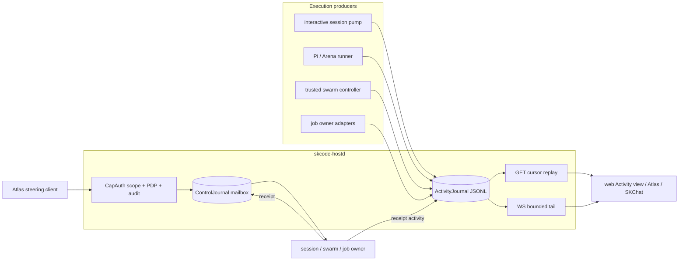

# Live agent observation and Atlas control

Status: implemented host boundary, 2026-08-21. Cards: `4c201d98` (observation)
and `dc50de99` (control), under Pi-swarm epic `0a3c64b8`.

## Decision

SKHarness exposes two separate planes through `skcode-hostd`:

1. a read-only, replayable activity plane for humans, Atlas, and future SKChat or
   SKComms views; and
2. an authenticated command plane for steering, with controller receipts that
   distinguish queued intent from applied action.

An activity event is never a command, verifier result, phase authorization, card
transition, or completion claim. A process exit, worker prose, or an `applied`
word in model output cannot mutate control state. Conversely, a queued control
command does not claim that an owner acted; only its controller receipt does.

## Activity contract

`src/skharness/activity.py` owns immutable `ActivityEvent` v1. Every event has a
global durable cursor and content hash plus controller-owned `session_id`,
`run_id`, `agent_id`, `job_id`, `role`, `phase`, and `source`. The kind vocabulary is
bounded: status, phase, assistant text, tool call/result, file change, test,
budget, disposition, and error. Its authority is always the literal
`observation`.

Every swarm event also carries a controller-owned lineage envelope: `card_id`
and immutable card hash, trajectory/team/parent-agent IDs, plan/contract IDs and
hashes, lease and attempt IDs, base commit, and evidence ID. These bytes are part
of the event content hash. They let Atlas move from a live line to the exact
child contract, controller lease, card snapshot, source commit, terminal attempt,
and content-addressed stdout/stderr without trusting a worker-authored name.
The same context is copied into the durable Arena terminal payload, so bounded
activity retention does not erase attribution.

Identity is an address, not authority. A unique agent ID makes routing and
attribution possible; CapAuth, the target owner, parent/child A2A ACL, signed
contract, live lease, and current-state check decide whether communication or
actuation is allowed. Stable sovereign agents retain their normal identity;
ephemeral Pi children receive controller-issued IDs bound to one trajectory and
contract. Reusing a friendly display name never inherits either identity or
authority.

The journal is a process-safe, flock-serialized, fsync'd JSONL under
`$SKCODE_STATE_DIR/activity` with node-local 0700/0600 permissions. Producers append whether or not a viewer is
connected. An incomplete tail is truncated by the next writer; corruption in a
newline-terminated row fails closed. Retention is byte bounded. A client whose
cursor fell behind receives an explicit gap envelope and resumes at the oldest
retained cursor rather than receiving invented continuity.

`GET /api/v1/activity` provides bounded replay and exact filters for session,
run, agent, job, card, contract, lease, role, and kind. `WS /api/v1/activity/stream` provides replay then
tail, fixed-size batches, heartbeats, and one in-flight send path per client.
Both require `skcode.stream`; neither has a write seam.

The built-in webapp's Activity view reconnects from its last cursor, shows
connection/gap state, and renders structured metadata with `textContent` only.
It adds no POST, PUT, DELETE, or implicit control.

### Producer behavior

- Interactive harness sessions are pumped independently of attached viewers.
  Their controller-issued `session-agent-<hash>` identity is stable for the
  session and traceable to `session_id` without pretending to be a sovereign
  long-lived profile. Assistant/status text is bounded. Tool arguments, tool results, and patch
  bodies are not copied into the activity journal.
- `PiExperimentRunner` tails complete Pi 0.84.2 NDJSON records while Docker is
  running. It publishes tool names, safe assistant text, phase, budget, file-change,
  and terminal
  artifact digests. Invalid/truncated records produce a controller-authored
  integrity error without copying the raw bytes.
- `PiSwarmWorkerRuntime` supplies the immutable trajectory, card, child-agent,
  parent/team, role, phase, plan/contract hash, lease, source commit, and evidence
  identities from the signed subagent contract. Production Pi runners and the
  checked-in swarm qualifier publish to the shared journal by default.
- `TrustedSwarmOrchestrator` mirrors assignment/result A2A envelopes into live
  activity with sender/recipient and lineage hashes, while the authoritative
  0600 A2A journal retains the full parent/child message. The live view stores a
  body digest, never the assignment prompt or result body.
- The configured job-ledger provider publishes a new first-class `job_id` event only
  when its observed status/freshness/run signature changes. It never copies the ledger's
  raw tail excerpt into activity.
- Raw stdout/stderr remain content-addressed evidence. The live activity rail is
  an operational window, not a replacement for immutable qualification records.

The activity sanitizer bounds depth, key count, strings, and event bytes; it
redacts credential-shaped keys and common inline bearer/token/API-key forms.
This is defense in depth. The stream remains an authenticated operational log
and must not be exposed publicly.

## Atlas command contract

`src/skharness/control.py` owns immutable `ControlCommand` and
`ControlReceipt` v1. A command binds the authenticated actor, idempotency key,
target kind (`session`, `run`, `agent`, or `job`), target ID, optional expected state,
action (`message`,
`needs_input_response`, `cancel`, `pause`, `resume`, or `retry`), bounded exact
payload digest, submission time, and expiry. Receipts distinguish `queued`,
`applying`, `applied`, `rejected`, `unsupported`, `conflict`, and `expired`.

`POST /api/v1/control` requires `skcode.inject` for `message` and
`needs_input_response`, while cancel/pause/resume/retry require the stronger
`skcode.dispatch`; both paths require the corresponding CapAuth PDP decision and
an audit sink. Audit records retain a payload hash, never message text. The
process-safe mailbox is rooted at `$SKCODE_STATE_DIR/control`, mode 0700/0600.
Reusing an actor/idempotency key with different bytes returns conflict. Replaying
an applied command returns its receipt and cannot actuate it twice.
HTTP command responses omit the exact payload and expose only its digest; the
node-local owner mailbox retains the bounded bytes required for actuation.

Interactive session `message`, `needs_input_response`, and `cancel` commands map
to the existing harness inject/cancel seams and return a synchronous terminal
receipt. Unsupported interactive actions get an explicit `unsupported` receipt.
Run, agent, and job commands are durably queued for their owning controller and
return HTTP 202; hostd does not falsely claim that a controller it does not own
has acted. A controller hosted in the same process may compose the explicit
`control_handler` and return a terminal owner decision synchronously. Separate
owners poll `ControlJournal.pending()`, move a command to `applying`, act under
their existing lease/state rules, and append a terminal receipt. Atlas
reads the latest state through `GET /api/v1/control/{command_id}`. Command and
receipt transitions also publish activity events containing only IDs, action,
status, and payload digest.

`SwarmAtlasControlOwner` is the first non-session owner adapter. It atomically
claims commands from the mailbox, matches only the exact trajectory or planned
child IDs, checks optional expected state, and routes `cancel` through
`SwarmScheduler.cancel_worker/cancel_team` plus the bounded Pi runtime stop and
quiescence acknowledgement. The checked-in Pi swarm qualifier composes it.
Message, needs-input, pause, resume, and retry are explicitly unsupported for Pi
children today because no safe turn-boundary seam exists; they never degrade to
direct stdin, PID, or Docker manipulation.

## Ownership and steering rules

- Atlas chooses intent; the execution owner remains authoritative for state,
  leases, budgets, path scopes, phase authorization, and cancellation.
- A target owner must revalidate current state and command expiry. `pause`,
  `resume`, and `retry` are capabilities, not assumptions: unsupported owners
  reject them explicitly.
- A swarm cancel targets a controller-known agent/lease and uses the existing
  bounded stop/quiescence proof. A message is admitted only at a declared
  interrupt/turn boundary; it may not rewrite a signed phase contract.
- Job retry creates a new attempt linked to the prior run. It never edits a
  terminal receipt in place. Job pause/resume belongs to the scheduler owner.
- Control payload bytes are untrusted operator data. They cannot expand tools,
  paths, network, model route, budget, role, verifier authority, or completion
  policy.

The generic mailbox and owner-handler seam are implemented now. Session actuation is
composed now. The Pi qualifier composes bounded swarm cancellation; another
long-lived swarm deployment must compose the same owner explicitly. Scheduler/job
owners still need their adapter before those target kinds can produce `applied`;
until then their honest state is `queued`. This is a deliberate visibility
property, not a soft success.

## Atlas and multi-node integration

Atlas should maintain one cursor per `(node_id, activity_journal_instance)`, not
one fleet-global integer. Each node owns its local journal; no shared-NFS
multi-writer log is permitted. Atlas merges node streams by observed timestamp
for display while retaining node and cursor as the ordering authority. On a gap,
it displays the missing interval and links immutable attempt artifacts rather
than pretending to reconstruct raw history.

OpenTelemetry spans and Prometheus counters may be derived from this rail, with
fixed-cardinality labels. They are not the source of truth. Session, run, card,
and agent IDs belong in authenticated structured events/traces, not Prometheus
labels. SKChat/SKComms integrations should remain thin clients of these APIs,
not create a second command or log store.

## Validation and failure behavior

The tests cover concurrent writers, restart continuity, retention gaps,
committed corruption, malformed Pi records, no raw Pi tool arguments/results,
secret redaction, live interactive pumping without a viewer, WebSocket auth and
cursor replay, control idempotency/conflict/expiry, PDP/audit fail-closed paths,
interactive actuation, and honest queued agent commands. A journal error cannot
change a worker result; it is counted in the attempt metrics and the replay route
fails integrity checks explicitly.

The remaining deployment qualification is operational: deploy the release on a
node, run one Pi swarm with Atlas attached, exercise one synchronous session
message/cancel and one owner-consumed swarm/job command, reconnect from a saved
cursor, and retain the redacted command/receipt/activity evidence bundle.
